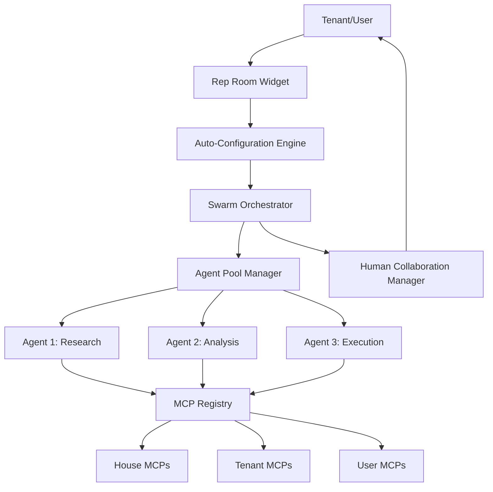

# DreamCrew Autonomous Swarm Orchestration System - Complete Technical Specification

**Version:** 1.0
**Date:** November 11, 2025
**Target Audience:** DreamCrew Platform Development Team
**Implementation Timeline:** 12 weeks

---

## Table of Contents

1. [Executive Summary](#executive-summary)
2. [Architecture Overview](#architecture-overview)
3. [Core Components](#core-components)
4. [Database Schema](#database-schema)
5. [MCP Server Architecture](#mcp-server-architecture)
6. [Agent Swarm Orchestration Engine](#agent-swarm-orchestration-engine)
7. [Auto-Configuration & Self-Reasoning System](#auto-configuration--self-reasoning-system)
8. [Tenant Onboarding & Setup](#tenant-onboarding--setup)
9. [Implementation Phases](#implementation-phases)
10. [API Specifications](#api-specifications)
11. [Security & Permissions](#security--permissions)
12. [Testing Strategy](#testing-strategy)

---

## Executive Summary

### Vision

DreamCrew will become the first **fully autonomous, self-configuring AI agent platform** that:

1. **Auto-discovers tenant needs** through conversational onboarding
2. **Self-configures MCP integrations** based on tenant business type
3. **Spawns intelligent agent swarms** that reason through complex tasks
4. **Requires zero technical knowledge** from tenants

### Key Innovation

**Traditional AI Platforms:**
```
Tenant manually configures → Predefines workflows → Agents execute scripts
❌ High setup friction
❌ Rigid workflows
❌ Requires technical expertise
```

**DreamCrew Autonomous System:**
```
Tenant describes business → System auto-configures → Agents reason autonomously
✅ Zero setup friction
✅ Adaptive workflows
✅ No technical knowledge required
```

### Business Impact

- **Onboarding time:** 3 weeks → 30 minutes
- **Configuration complexity:** High → Zero (autonomous)
- **Agent capability:** Scripted → Reasoning-based
- **Tenant technical requirements:** Advanced → None
- **Scalability:** Linear → Exponential

---

## Architecture Overview

### System Layers

```
┌─────────────────────────────────────────────────────────────────┐
│                    TENANT INTERFACE LAYER                        │
│  (Rep Rooms, Dashboards, Conversational Configuration)          │
└─────────────────────────────────────────────────────────────────┘
                              ↓
┌─────────────────────────────────────────────────────────────────┐
│               AUTO-CONFIGURATION ENGINE LAYER                    │
│  (Business Type Detection, MCP Discovery, Tool Selection)       │
└─────────────────────────────────────────────────────────────────┘
                              ↓
┌─────────────────────────────────────────────────────────────────┐
│            SWARM ORCHESTRATION ENGINE LAYER                      │
│  (Task Decomposition, Agent Spawning, Wave Execution)           │
└─────────────────────────────────────────────────────────────────┘
                              ↓
┌─────────────────────────────────────────────────────────────────┐
│                    MCP INTEGRATION LAYER                         │
│  ┌──────────────┐  ┌──────────────┐  ┌──────────────┐         │
│  │  House-Level │  │ Tenant-Level │  │  User-Level  │         │
│  │ MCP Servers  │  │ MCP Servers  │  │ MCP Servers  │         │
│  └──────────────┘  └──────────────┘  └──────────────┘         │
└─────────────────────────────────────────────────────────────────┘
                              ↓
┌─────────────────────────────────────────────────────────────────┐
│                   AGENT REASONING ENGINE                         │
│  (Claude API, Tool Invocation, Decision Making)                 │
└─────────────────────────────────────────────────────────────────┘
                              ↓
┌─────────────────────────────────────────────────────────────────┐
│                    EXECUTION & STORAGE LAYER                     │
│  (Supabase, PostgreSQL, Edge Functions, Realtime)              │
└─────────────────────────────────────────────────────────────────┘
```

### Component Relationships



---

## Core Components

### 1. SwarmOrchestrator

**Purpose:** Coordinates multi-agent execution with autonomous reasoning

**Location:** `packages/dreamcrew-orchestrator/src/SwarmOrchestrator.ts`

**Key Responsibilities:**
- Receive high-level goals from users
- Decompose goals into executable tasks
- Spawn specialized agents dynamically
- Coordinate wave-based parallel execution
- Manage human-in-the-loop interactions
- Aggregate results and provide summaries

```typescript
// packages/dreamcrew-orchestrator/src/SwarmOrchestrator.ts

import Anthropic from '@anthropic-ai/sdk';
import { MCPServerRegistry } from './MCPServerRegistry';
import { AgentReasoningEngine } from './AgentReasoningEngine';
import { TaskDecomposer } from './TaskDecomposer';
import { AgentPoolManager } from './AgentPoolManager';
import { HumanCollaborationManager } from './HumanCollaborationManager';

export interface SwarmConfig {
  tenantId: string;
  projectId?: string;
  anthropicApiKey: string;
  maxConcurrentAgents: number;
  enableHumanCollaboration: boolean;
}

export interface ExecutionContext {
  userId: string;
  sessionId: string;
  goal: string;
  initialContext: Record<string, any>;
  constraints?: {
    maxDuration?: number; // milliseconds
    maxCost?: number; // credits
    requireApproval?: boolean;
  };
}

export interface SwarmResult {
  success: boolean;
  executionId: string;
  goal: string;
  summary: string;
  tasks: TaskResult[];
  totalDuration: number; // milliseconds
  totalCreditsUsed: number;
  humanInteractions: HumanInteraction[];
  artifacts: Artifact[];
}

export class SwarmOrchestrator {
  private anthropic: Anthropic;
  private mcpRegistry: MCPServerRegistry;
  private reasoningEngine: AgentReasoningEngine;
  private taskDecomposer: TaskDecomposer;
  private agentPoolManager: AgentPoolManager;
  private humanCollabManager: HumanCollaborationManager;
  private config: SwarmConfig;

  constructor(config: SwarmConfig) {
    this.config = config;

    this.anthropic = new Anthropic({
      apiKey: config.anthropicApiKey,
    });

    this.mcpRegistry = new MCPServerRegistry({
      tenantId: config.tenantId,
    });

    this.reasoningEngine = new AgentReasoningEngine({
      anthropic: this.anthropic,
      mcpRegistry: this.mcpRegistry,
    });

    this.taskDecomposer = new TaskDecomposer({
      reasoningEngine: this.reasoningEngine,
    });

    this.agentPoolManager = new AgentPoolManager({
      maxConcurrentAgents: config.maxConcurrentAgents,
      reasoningEngine: this.reasoningEngine,
    });

    this.humanCollabManager = new HumanCollaborationManager({
      tenantId: config.tenantId,
      enabled: config.enableHumanCollaboration,
    });
  }

  /**
   * Main entry point: Execute a high-level goal with autonomous agent swarm
   */
  async executeGoal(
    goal: string,
    context: ExecutionContext
  ): Promise<SwarmResult> {
    const startTime = Date.now();

    // Create swarm execution record
    const executionId = await this.createSwarmExecution(goal, context);

    try {
      // PHASE 1: Task Decomposition
      const tasks = await this.taskDecomposer.decompose(goal, context);

      await this.updateSwarmStatus(executionId, 'decomposing', {
        taskCount: tasks.length,
      });

      // PHASE 2: Build dependency graph
      const taskGraph = this.buildDependencyGraph(tasks);

      // PHASE 3: Get available tools from MCP registry
      const availableTools = await this.mcpRegistry.getAllAvailableTools();

      // PHASE 4: Execute tasks in waves (parallel where possible)
      const results = await this.executeInWaves(
        executionId,
        taskGraph,
        availableTools,
        context
      );

      // PHASE 5: Aggregate results
      const summary = await this.generateSummary(goal, results);

      const totalDuration = Date.now() - startTime;
      const totalCredits = this.calculateCreditsUsed(results);

      await this.updateSwarmStatus(executionId, 'completed', {
        duration: totalDuration,
        creditsUsed: totalCredits,
      });

      return {
        success: true,
        executionId,
        goal,
        summary,
        tasks: results,
        totalDuration,
        totalCreditsUsed: totalCredits,
        humanInteractions: this.humanCollabManager.getInteractions(executionId),
        artifacts: this.extractArtifacts(results),
      };

    } catch (error) {
      await this.updateSwarmStatus(executionId, 'failed', {
        error: error.message,
      });

      throw error;
    }
  }

  /**
   * Execute tasks in parallel waves based on dependencies
   */
  private async executeInWaves(
    executionId: string,
    taskGraph: TaskGraph,
    availableTools: MCPTool[],
    context: ExecutionContext
  ): Promise<TaskResult[]> {
    const waves = taskGraph.getExecutionWaves();
    const allResults: TaskResult[] = [];

    for (let waveIndex = 0; waveIndex < waves.length; waveIndex++) {
      const wave = waves[waveIndex];

      await this.updateSwarmStatus(executionId, 'executing', {
        currentWave: waveIndex + 1,
        totalWaves: waves.length,
        tasksInWave: wave.tasks.length,
      });

      // Execute all tasks in this wave in parallel
      const wavePromises = wave.tasks.map(task =>
        this.executeTask(
          executionId,
          task,
          availableTools,
          allResults, // Previous results for context
          context
        )
      );

      const waveResults = await Promise.all(wavePromises);
      allResults.push(...waveResults);

      // Check if human approval needed before continuing
      if (this.config.enableHumanCollaboration) {
        const needsApproval = await this.checkApprovalNeeded(waveResults);

        if (needsApproval) {
          const approved = await this.humanCollabManager.requestApproval(
            executionId,
            {
              wave: waveIndex + 1,
              results: waveResults,
              nextWave: waves[waveIndex + 1],
            }
          );

          if (!approved) {
            throw new Error('Human rejected execution at wave ' + (waveIndex + 1));
          }
        }
      }
    }

    return allResults;
  }

  /**
   * Execute a single task with an autonomous agent
   */
  private async executeTask(
    executionId: string,
    task: Task,
    availableTools: MCPTool[],
    previousResults: TaskResult[],
    context: ExecutionContext
  ): Promise<TaskResult> {
    const startTime = Date.now();

    // Spawn agent from pool
    const agent = await this.agentPoolManager.spawnAgent({
      taskId: task.id,
      taskType: task.type,
      specialization: task.requiredExpertise,
    });

    try {
      // Build context from previous results
      const taskContext = this.buildTaskContext(task, previousResults, context);

      // Generate agent prompt (lets agent reason autonomously)
      const agentPrompt = this.generateAgentPrompt(task, taskContext, availableTools);

      // Execute with reasoning engine
      const result = await this.reasoningEngine.executeWithReasoning(
        agentPrompt,
        availableTools,
        {
          agentId: agent.id,
          executionId,
          taskId: task.id,
          maxIterations: 10, // Allow agent to iterate and refine
          enableThinking: true, // Use Claude's extended thinking
        }
      );

      const duration = Date.now() - startTime;

      // Store task result
      await this.storeTaskResult(executionId, task.id, result, duration);

      return {
        taskId: task.id,
        taskName: task.name,
        success: true,
        output: result.output,
        reasoning: result.reasoning,
        toolInvocations: result.toolInvocations,
        duration,
        agentId: agent.id,
      };

    } catch (error) {
      const duration = Date.now() - startTime;

      return {
        taskId: task.id,
        taskName: task.name,
        success: false,
        error: error.message,
        duration,
        agentId: agent.id,
      };

    } finally {
      // Return agent to pool
      await this.agentPoolManager.releaseAgent(agent.id);
    }
  }

  /**
   * Generate autonomous agent prompt
   * Key: Give agent the GOAL and TOOLS, let it figure out HOW
   */
  private generateAgentPrompt(
    task: Task,
    context: TaskContext,
    tools: MCPTool[]
  ): string {
    return `
You are an autonomous AI agent working on a specific subtask as part of a larger project.

GOAL: ${task.goal}

CONTEXT:
${JSON.stringify(context, null, 2)}

AVAILABLE TOOLS:
${tools.map(t => `- ${t.name}: ${t.description}`).join('\n')}

YOUR MISSION:
1. Analyze the goal and determine the best approach to achieve it
2. Use the available tools strategically to gather information and take actions
3. Reason through the problem step-by-step
4. If you encounter obstacles, try alternative approaches
5. If you need human input, ask conversationally (don't use forms)
6. Report your progress and findings clearly

IMPORTANT GUIDELINES:
- You have full autonomy to figure out HOW to achieve the goal
- Think critically and creatively - don't just follow a script
- Use multiple tools in combination if needed
- Validate your work before marking complete
- Ask for human help if you're genuinely stuck
- Cite sources when using knowledge base information

CONSTRAINTS:
${task.constraints ? JSON.stringify(task.constraints, null, 2) : 'None specified'}

Begin by stating your approach, then execute it.
    `.trim();
  }

  /**
   * Build dependency graph for parallel execution
   */
  private buildDependencyGraph(tasks: Task[]): TaskGraph {
    const graph = new TaskGraph();

    for (const task of tasks) {
      graph.addNode(task);
    }

    // Add edges for dependencies
    for (const task of tasks) {
      if (task.dependencies && task.dependencies.length > 0) {
        for (const depId of task.dependencies) {
          graph.addEdge(depId, task.id);
        }
      }
    }

    return graph;
  }

  /**
   * Build task context from previous results
   */
  private buildTaskContext(
    task: Task,
    previousResults: TaskResult[],
    executionContext: ExecutionContext
  ): TaskContext {
    // Get results from dependency tasks
    const dependencyResults = previousResults.filter(r =>
      task.dependencies?.includes(r.taskId)
    );

    return {
      executionGoal: executionContext.goal,
      taskGoal: task.goal,
      dependencyOutputs: dependencyResults.map(r => ({
        taskName: r.taskName,
        output: r.output,
        reasoning: r.reasoning,
      })),
      userContext: executionContext.initialContext,
      tenantId: this.config.tenantId,
      sessionId: executionContext.sessionId,
    };
  }

  /**
   * Generate human-readable summary of swarm execution
   */
  private async generateSummary(
    goal: string,
    results: TaskResult[]
  ): Promise<string> {
    const successfulTasks = results.filter(r => r.success);
    const failedTasks = results.filter(r => !r.success);

    const summaryPrompt = `
Summarize the following swarm execution results in 2-3 concise paragraphs for a business user:

GOAL: ${goal}

TASKS COMPLETED: ${successfulTasks.length}/${results.length}

SUCCESSFUL TASKS:
${successfulTasks.map(t => `- ${t.taskName}: ${t.output}`).join('\n')}

${failedTasks.length > 0 ? `FAILED TASKS:\n${failedTasks.map(t => `- ${t.taskName}: ${t.error}`).join('\n')}` : ''}

Focus on:
1. What was accomplished
2. Key findings or insights
3. Recommended next steps (if applicable)
    `.trim();

    const response = await this.anthropic.messages.create({
      model: 'claude-sonnet-4-5-20250929',
      max_tokens: 1024,
      messages: [{ role: 'user', content: summaryPrompt }],
    });

    return response.content[0].type === 'text' ? response.content[0].text : '';
  }

  // Database operations

  private async createSwarmExecution(
    goal: string,
    context: ExecutionContext
  ): Promise<string> {
    // Implementation in database section
    return 'execution-uuid';
  }

  private async updateSwarmStatus(
    executionId: string,
    status: string,
    metadata: Record<string, any>
  ): Promise<void> {
    // Implementation in database section
  }

  private async storeTaskResult(
    executionId: string,
    taskId: string,
    result: any,
    duration: number
  ): Promise<void> {
    // Implementation in database section
  }

  private calculateCreditsUsed(results: TaskResult[]): number {
    // Each tool invocation costs credits based on complexity
    return results.reduce((total, r) => {
      const invocations = r.toolInvocations?.length || 0;
      return total + (invocations * 10); // Base: 10 credits per tool call
    }, 0);
  }

  private async checkApprovalNeeded(results: TaskResult[]): Promise<boolean> {
    // Check if any result requires human approval
    return results.some(r => r.requiresApproval === true);
  }

  private extractArtifacts(results: TaskResult[]): Artifact[] {
    // Extract any generated files, reports, etc.
    return results
      .filter(r => r.artifacts)
      .flatMap(r => r.artifacts);
  }
}

// Supporting types

export interface Task {
  id: string;
  name: string;
  type: string;
  goal: string;
  dependencies: string[];
  requiredExpertise?: string[];
  constraints?: Record<string, any>;
}

export interface TaskResult {
  taskId: string;
  taskName: string;
  success: boolean;
  output?: string;
  error?: string;
  reasoning?: string;
  toolInvocations?: ToolInvocation[];
  duration: number;
  agentId: string;
  requiresApproval?: boolean;
  artifacts?: Artifact[];
}

export interface TaskContext {
  executionGoal: string;
  taskGoal: string;
  dependencyOutputs: Array<{
    taskName: string;
    output: string;
    reasoning?: string;
  }>;
  userContext: Record<string, any>;
  tenantId: string;
  sessionId: string;
}

export interface ToolInvocation {
  toolName: string;
  input: Record<string, any>;
  output: any;
  duration: number;
  creditsUsed: number;
}

export interface Artifact {
  type: 'file' | 'report' | 'data' | 'link';
  name: string;
  url?: string;
  content?: string;
  metadata?: Record<string, any>;
}

export interface HumanInteraction {
  type: 'question' | 'approval' | 'notification';
  timestamp: Date;
  message: string;
  response?: string;
  responseTime?: number; // milliseconds
}

class TaskGraph {
  private nodes: Map<string, Task> = new Map();
  private edges: Map<string, string[]> = new Map();

  addNode(task: Task) {
    this.nodes.set(task.id, task);
  }

  addEdge(fromId: string, toId: string) {
    if (!this.edges.has(fromId)) {
      this.edges.set(fromId, []);
    }
    this.edges.get(fromId)!.push(toId);
  }

  /**
   * Get execution waves (tasks grouped by dependency level)
   * Wave 1: Tasks with no dependencies
   * Wave 2: Tasks that depend only on Wave 1
   * etc.
   */
  getExecutionWaves(): Wave[] {
    const waves: Wave[] = [];
    const completed = new Set<string>();
    const remaining = new Set(this.nodes.keys());

    while (remaining.size > 0) {
      const wave: Task[] = [];

      for (const taskId of remaining) {
        const task = this.nodes.get(taskId)!;

        // Check if all dependencies are completed
        const dependenciesMet = (task.dependencies || []).every(depId =>
          completed.has(depId)
        );

        if (dependenciesMet) {
          wave.push(task);
        }
      }

      if (wave.length === 0) {
        throw new Error('Circular dependency detected in task graph');
      }

      waves.push({ tasks: wave, waveNumber: waves.length + 1 });

      // Mark these tasks as completed for next wave
      for (const task of wave) {
        completed.add(task.id);
        remaining.delete(task.id);
      }
    }

    return waves;
  }
}

interface Wave {
  tasks: Task[];
  waveNumber: number;
}
```

---

### 2. MCPServerRegistry

**Purpose:** Manages all MCP servers (House, Tenant, User levels) and their available tools

**Location:** `packages/dreamcrew-orchestrator/src/MCPServerRegistry.ts`

```typescript
// packages/dreamcrew-orchestrator/src/MCPServerRegistry.ts

import { Client } from '@modelcontextprotocol/sdk/client/index.js';
import { StdioClientTransport } from '@modelcontextprotocol/sdk/client/stdio.js';
import { createClient } from '@supabase/supabase-js';

export interface MCPServerConfig {
  id: string;
  name: string;
  level: 'house' | 'tenant' | 'user';
  connectionType: 'stdio' | 'sse';
  connectionConfig: {
    command?: string;
    args?: string[];
    url?: string;
  };
  credentialsRequired: boolean;
  credentials?: Record<string, string>;
  enabled: boolean;
}

export interface MCPTool {
  serverId: string;
  serverName: string;
  name: string;
  description: string;
  inputSchema: Record<string, any>;
  level: 'house' | 'tenant' | 'user';
}

export class MCPServerRegistry {
  private tenantId: string;
  private supabase: ReturnType<typeof createClient>;
  private connectedServers: Map<string, Client> = new Map();
  private cachedTools: MCPTool[] | null = null;

  constructor(config: { tenantId: string }) {
    this.tenantId = config.tenantId;

    this.supabase = createClient(
      process.env.SUPABASE_URL!,
      process.env.SUPABASE_SERVICE_ROLE_KEY!
    );
  }

  /**
   * Get all available tools from all connected MCP servers
   * Returns tools from House, Tenant, and User levels
   */
  async getAllAvailableTools(userId?: string): Promise<MCPTool[]> {
    // Check cache first
    if (this.cachedTools) {
      return this.cachedTools;
    }

    const tools: MCPTool[] = [];

    // 1. Get House-level MCP servers (always available)
    const houseServers = await this.getHouseMCPServers();

    for (const server of houseServers) {
      const serverTools = await this.getToolsFromServer(server);
      tools.push(...serverTools);
    }

    // 2. Get Tenant-level MCP servers
    const tenantServers = await this.getTenantMCPServers(this.tenantId);

    for (const server of tenantServers) {
      const serverTools = await this.getToolsFromServer(server);
      tools.push(...serverTools);
    }

    // 3. Get User-level MCP servers (if userId provided)
    if (userId) {
      const userServers = await this.getUserMCPServers(userId);

      for (const server of userServers) {
        const serverTools = await this.getToolsFromServer(server);
        tools.push(...serverTools);
      }
    }

    // Cache for 5 minutes
    this.cachedTools = tools;
    setTimeout(() => { this.cachedTools = null; }, 5 * 60 * 1000);

    return tools;
  }

  /**
   * Execute a tool from any connected MCP server
   */
  async executeTool(
    toolName: string,
    input: Record<string, any>
  ): Promise<any> {
    // Find which server provides this tool
    const allTools = await this.getAllAvailableTools();
    const tool = allTools.find(t => t.name === toolName);

    if (!tool) {
      throw new Error(`Tool not found: ${toolName}`);
    }

    // Get or create connection to server
    const client = await this.getServerConnection(tool.serverId);

    // Execute tool via MCP protocol
    const result = await client.request({
      method: 'tools/call',
      params: {
        name: toolName,
        arguments: input,
      },
    });

    return result;
  }

  /**
   * Connect to an MCP server and get its available tools
   */
  private async getToolsFromServer(
    server: MCPServerConfig
  ): Promise<MCPTool[]> {
    try {
      const client = await this.getServerConnection(server.id);

      // List available tools
      const response = await client.request({
        method: 'tools/list',
        params: {},
      });

      return response.tools.map((tool: any) => ({
        serverId: server.id,
        serverName: server.name,
        name: tool.name,
        description: tool.description,
        inputSchema: tool.inputSchema,
        level: server.level,
      }));

    } catch (error) {
      console.error(`Failed to get tools from ${server.name}:`, error);
      return [];
    }
  }

  /**
   * Get or create connection to MCP server
   */
  private async getServerConnection(serverId: string): Promise<Client> {
    // Check if already connected
    if (this.connectedServers.has(serverId)) {
      return this.connectedServers.get(serverId)!;
    }

    // Get server config
    const { data: server } = await this.supabase
      .from('mcp_servers')
      .select('*')
      .eq('id', serverId)
      .single();

    if (!server) {
      throw new Error(`MCP server not found: ${serverId}`);
    }

    // Create client
    const client = new Client({
      name: 'dreamcrew-orchestrator',
      version: '1.0.0',
    }, {
      capabilities: {},
    });

    // Create transport based on connection type
    let transport;

    if (server.connection_type === 'stdio') {
      transport = new StdioClientTransport({
        command: server.connection_config.command,
        args: server.connection_config.args || [],
      });
    } else {
      throw new Error('SSE transport not yet implemented');
    }

    // Connect
    await client.connect(transport);

    // Cache connection
    this.connectedServers.set(serverId, client);

    return client;
  }

  /**
   * Get House-level MCP servers (available to all tenants)
   */
  private async getHouseMCPServers(): Promise<MCPServerConfig[]> {
    const { data, error } = await this.supabase
      .from('mcp_servers')
      .select('*')
      .eq('level', 'house')
      .eq('status', 'active');

    if (error) throw error;
    return data || [];
  }

  /**
   * Get Tenant-level MCP servers
   */
  private async getTenantMCPServers(tenantId: string): Promise<MCPServerConfig[]> {
    const { data, error } = await this.supabase
      .from('mcp_servers')
      .select('*')
      .eq('level', 'tenant')
      .eq('tenant_id', tenantId)
      .eq('status', 'active');

    if (error) throw error;
    return data || [];
  }

  /**
   * Get User-level MCP servers
   */
  private async getUserMCPServers(userId: string): Promise<MCPServerConfig[]> {
    const { data, error } = await this.supabase
      .from('mcp_servers')
      .select('*')
      .eq('level', 'user')
      .eq('user_id', userId)
      .eq('status', 'active');

    if (error) throw error;
    return data || [];
  }

  /**
   * Close all server connections
   */
  async closeAll(): Promise<void> {
    for (const [serverId, client] of this.connectedServers) {
      try {
        await client.close();
      } catch (error) {
        console.error(`Error closing connection to ${serverId}:`, error);
      }
    }
    this.connectedServers.clear();
  }
}
```

---

### 3. TaskDecomposer

**Purpose:** Uses AI reasoning to break down high-level goals into executable tasks

**Location:** `packages/dreamcrew-orchestrator/src/TaskDecomposer.ts`

```typescript
// packages/dreamcrew-orchestrator/src/TaskDecomposer.ts

import { AgentReasoningEngine } from './AgentReasoningEngine';
import { Task, ExecutionContext } from './SwarmOrchestrator';

export class TaskDecomposer {
  private reasoningEngine: AgentReasoningEngine;

  constructor(config: { reasoningEngine: AgentReasoningEngine }) {
    this.reasoningEngine = config.reasoningEngine;
  }

  /**
   * Decompose a high-level goal into executable tasks with dependencies
   */
  async decompose(
    goal: string,
    context: ExecutionContext
  ): Promise<Task[]> {
    const decompositionPrompt = this.buildDecompositionPrompt(goal, context);

    const result = await this.reasoningEngine.think(decompositionPrompt);

    // Parse AI response into structured tasks
    const tasks = this.parseTasksFromResponse(result);

    // Validate task graph (no circular dependencies)
    this.validateTaskGraph(tasks);

    return tasks;
  }

  private buildDecompositionPrompt(
    goal: string,
    context: ExecutionContext
  ): string {
    return `
You are an expert task decomposition AI. Your job is to break down a high-level goal into a set of concrete, executable tasks.

GOAL: ${goal}

CONTEXT:
${JSON.stringify(context.initialContext, null, 2)}

INSTRUCTIONS:
1. Break the goal into 3-8 specific, actionable tasks
2. Each task should have a clear, measurable outcome
3. Identify dependencies between tasks (which tasks must complete before others)
4. Assign each task a type based on what it needs to do:
   - research: Gather information (web search, knowledge base lookup)
   - analysis: Process and analyze data
   - execution: Take action (API calls, create records, send messages)
   - communication: Human interaction (ask questions, get approval)

5. For each task, specify what expertise or tools might be needed

RESPOND IN THIS EXACT JSON FORMAT:
{
  "tasks": [
    {
      "id": "task-1",
      "name": "Short descriptive name",
      "goal": "Specific goal for this task",
      "type": "research|analysis|execution|communication",
      "dependencies": ["task-id-that-must-complete-first"],
      "requiredExpertise": ["domain-knowledge", "tool-type"],
      "constraints": { "key": "value" }
    }
  ]
}

EXAMPLE for "Launch Google Ads campaign for bakery":
{
  "tasks": [
    {
      "id": "task-1",
      "name": "Research competitor keywords",
      "goal": "Identify high-value keywords competitors are using",
      "type": "research",
      "dependencies": [],
      "requiredExpertise": ["seo", "keyword-research"]
    },
    {
      "id": "task-2",
      "name": "Analyze target audience",
      "goal": "Determine demographics and interests of ideal customers",
      "type": "analysis",
      "dependencies": ["task-1"],
      "requiredExpertise": ["marketing", "audience-analysis"]
    },
    {
      "id": "task-3",
      "name": "Create ad copy variations",
      "goal": "Write 3 different ad headlines and descriptions",
      "type": "execution",
      "dependencies": ["task-2"],
      "requiredExpertise": ["copywriting", "google-ads"]
    },
    {
      "id": "task-4",
      "name": "Get human approval on ads",
      "goal": "Present ad variations and get client to choose one",
      "type": "communication",
      "dependencies": ["task-3"],
      "requiredExpertise": ["communication"]
    },
    {
      "id": "task-5",
      "name": "Launch campaign",
      "goal": "Create campaign in Google Ads with approved copy and budget",
      "type": "execution",
      "dependencies": ["task-4"],
      "requiredExpertise": ["google-ads-api"]
    }
  ]
}

Now decompose this goal. Think carefully about dependencies and parallelization opportunities.
    `.trim();
  }

  private parseTasksFromResponse(response: string): Task[] {
    try {
      // Extract JSON from response (might be wrapped in markdown code blocks)
      const jsonMatch = response.match(/```json\s*(\{[\s\S]*?\})\s*```/) ||
                       response.match(/(\{[\s\S]*\})/);

      if (!jsonMatch) {
        throw new Error('No JSON found in response');
      }

      const parsed = JSON.parse(jsonMatch[1]);

      if (!parsed.tasks || !Array.isArray(parsed.tasks)) {
        throw new Error('Invalid task structure');
      }

      return parsed.tasks.map((t: any) => ({
        id: t.id,
        name: t.name,
        type: t.type,
        goal: t.goal,
        dependencies: t.dependencies || [],
        requiredExpertise: t.requiredExpertise || [],
        constraints: t.constraints || {},
      }));

    } catch (error) {
      throw new Error(`Failed to parse tasks from AI response: ${error.message}`);
    }
  }

  private validateTaskGraph(tasks: Task[]): void {
    // Check for circular dependencies using depth-first search
    const visited = new Set<string>();
    const recursionStack = new Set<string>();

    const hasCycle = (taskId: string): boolean => {
      visited.add(taskId);
      recursionStack.add(taskId);

      const task = tasks.find(t => t.id === taskId);
      if (!task) return false;

      for (const depId of task.dependencies) {
        if (!visited.has(depId)) {
          if (hasCycle(depId)) return true;
        } else if (recursionStack.has(depId)) {
          return true; // Cycle detected
        }
      }

      recursionStack.delete(taskId);
      return false;
    };

    for (const task of tasks) {
      if (!visited.has(task.id)) {
        if (hasCycle(task.id)) {
          throw new Error('Circular dependency detected in task graph');
        }
      }
    }

    // Validate that all dependencies exist
    const taskIds = new Set(tasks.map(t => t.id));
    for (const task of tasks) {
      for (const depId of task.dependencies) {
        if (!taskIds.has(depId)) {
          throw new Error(`Task ${task.id} depends on non-existent task ${depId}`);
        }
      }
    }
  }
}
```

This is the first part of the comprehensive specification. Should I continue with the remaining components (AgentReasoningEngine, Auto-Configuration Engine, Database Schema, etc.)?
---

### 4. AgentReasoningEngine

**Purpose:** Core reasoning layer that enables agents to think autonomously and make decisions

**Location:** `packages/dreamcrew-orchestrator/src/AgentReasoningEngine.ts`

```typescript
// packages/dreamcrew-orchestrator/src/AgentReasoningEngine.ts

import Anthropic from '@anthropic-ai/sdk';
import { MCPServerRegistry, MCPTool } from './MCPServerRegistry';

export interface ReasoningConfig {
  anthropic: Anthropic;
  mcpRegistry: MCPServerRegistry;
}

export interface ReasoningResult {
  output: string;
  reasoning: string;
  toolInvocations: ToolInvocation[];
  iterations: number;
  success: boolean;
}

export interface ToolInvocation {
  toolName: string;
  input: Record<string, any>;
  output: any;
  duration: number;
  creditsUsed: number;
}

export class AgentReasoningEngine {
  private anthropic: Anthropic;
  private mcpRegistry: MCPServerRegistry;

  constructor(config: ReasoningConfig) {
    this.anthropic = config.anthropic;
    this.mcpRegistry = config.mcpRegistry;
  }

  /**
   * Execute a task with autonomous reasoning
   * Agent iterates until task is complete or max iterations reached
   */
  async executeWithReasoning(
    prompt: string,
    availableTools: MCPTool[],
    options: {
      agentId: string;
      executionId: string;
      taskId: string;
      maxIterations?: number;
      enableThinking?: boolean;
    }
  ): Promise<ReasoningResult> {
    const maxIterations = options.maxIterations || 10;
    const conversationHistory: Anthropic.MessageParam[] = [];
    const toolInvocations: ToolInvocation[] = [];

    // Initial prompt
    conversationHistory.push({
      role: 'user',
      content: prompt,
    });

    let iterations = 0;
    let taskComplete = false;

    while (iterations < maxIterations && !taskComplete) {
      iterations++;

      // Call Claude with tools
      const response = await this.anthropic.messages.create({
        model: 'claude-sonnet-4-5-20250929',
        max_tokens: 8096,
        tools: this.convertToAnthropicTools(availableTools),
        messages: conversationHistory,
        thinking: options.enableThinking ? {
          type: 'enabled',
          budget_tokens: 2000,
        } : undefined,
      });

      // Add assistant response to history
      conversationHistory.push({
        role: 'assistant',
        content: response.content,
      });

      // Check if agent wants to use tools
      const toolUses = response.content.filter(
        (block: any) => block.type === 'tool_use'
      );

      if (toolUses.length === 0) {
        // No more tools needed, agent is done
        taskComplete = true;

        // Extract final output
        const textBlocks = response.content.filter(
          (block: any) => block.type === 'text'
        );
        const output = textBlocks.map((b: any) => b.text).join('\n');

        // Extract thinking/reasoning if available
        const thinkingBlocks = response.content.filter(
          (block: any) => block.type === 'thinking'
        );
        const reasoning = thinkingBlocks.map((b: any) => b.thinking).join('\n');

        return {
          output,
          reasoning,
          toolInvocations,
          iterations,
          success: true,
        };
      }

      // Execute tools
      const toolResults: Anthropic.ToolResultBlockParam[] = [];

      for (const toolUse of toolUses) {
        const startTime = Date.now();

        try {
          // Execute tool via MCP registry
          const result = await this.mcpRegistry.executeTool(
            toolUse.name,
            toolUse.input
          );

          const duration = Date.now() - startTime;

          toolInvocations.push({
            toolName: toolUse.name,
            input: toolUse.input,
            output: result,
            duration,
            creditsUsed: 10, // Base cost per tool invocation
          });

          toolResults.push({
            type: 'tool_result',
            tool_use_id: toolUse.id,
            content: JSON.stringify(result, null, 2),
          });

        } catch (error) {
          const duration = Date.now() - startTime;

          toolResults.push({
            type: 'tool_result',
            tool_use_id: toolUse.id,
            content: `Error: ${error.message}`,
            is_error: true,
          });
        }
      }

      // Add tool results to conversation
      conversationHistory.push({
        role: 'user',
        content: toolResults,
      });
    }

    // Max iterations reached
    return {
      output: 'Task incomplete: Maximum iterations reached',
      reasoning: 'Agent hit iteration limit without completing task',
      toolInvocations,
      iterations,
      success: false,
    };
  }

  /**
   * Have the agent think through a problem without taking action
   */
  async think(prompt: string): Promise<string> {
    const response = await this.anthropic.messages.create({
      model: 'claude-sonnet-4-5-20250929',
      max_tokens: 4096,
      messages: [{ role: 'user', content: prompt }],
      thinking: {
        type: 'enabled',
        budget_tokens: 2000,
      },
    });

    const textBlocks = response.content.filter(
      (block: any) => block.type === 'text'
    );

    return textBlocks.map((b: any) => b.text).join('\n');
  }

  /**
   * Convert MCP tools to Anthropic tool format
   */
  private convertToAnthropicTools(
    mcpTools: MCPTool[]
  ): Anthropic.Tool[] {
    return mcpTools.map(tool => ({
      name: tool.name,
      description: tool.description,
      input_schema: tool.inputSchema,
    }));
  }
}
```

---

## Database Schema

### Overview

The database schema supports multi-tenant swarm orchestration with hierarchical MCP servers and autonomous agent reasoning.

**Key Tables:**
1. `swarm_executions` - Track swarm execution sessions
2. `swarm_tasks` - Individual tasks within a swarm
3. `agent_workers` - Active agent instances
4. `mcp_servers` - MCP server registry (House/Tenant/User levels)
5. `mcp_tool_invocations` - Audit trail of tool usage
6. `business_type_configs` - Auto-configuration templates
7. `tenant_knowledge_items` - Tenant-level knowledge base
8. `user_knowledge_items` - User-level knowledge base

---

### 1. Swarm Executions Table

```sql
CREATE TABLE swarm_executions (
  id UUID PRIMARY KEY DEFAULT gen_random_uuid(),
  
  -- Ownership
  tenant_id UUID NOT NULL REFERENCES organizations(id) ON DELETE CASCADE,
  user_id UUID REFERENCES users(id) ON DELETE SET NULL,
  project_id UUID REFERENCES agentic_projects(id) ON DELETE SET NULL,
  
  -- Execution metadata
  goal TEXT NOT NULL,
  status TEXT NOT NULL CHECK (status IN ('pending', 'decomposing', 'executing', 'completed', 'failed', 'cancelled')),
  
  -- Context
  initial_context JSONB DEFAULT '{}'::jsonb,
  constraints JSONB DEFAULT '{}'::jsonb,
  
  -- Results
  summary TEXT,
  total_tasks INTEGER DEFAULT 0,
  completed_tasks INTEGER DEFAULT 0,
  failed_tasks INTEGER DEFAULT 0,
  
  -- Performance metrics
  started_at TIMESTAMPTZ DEFAULT NOW(),
  completed_at TIMESTAMPTZ,
  total_duration_ms INTEGER,
  total_credits_used NUMERIC(12,2) DEFAULT 0,
  
  -- Wave execution tracking
  current_wave INTEGER DEFAULT 0,
  total_waves INTEGER DEFAULT 0,
  
  -- Artifacts
  artifacts JSONB DEFAULT '[]'::jsonb,
  
  -- Human interactions
  human_interactions JSONB DEFAULT '[]'::jsonb,
  
  -- Audit
  created_at TIMESTAMPTZ DEFAULT NOW(),
  updated_at TIMESTAMPTZ DEFAULT NOW()
);

-- Indexes
CREATE INDEX idx_swarm_executions_tenant ON swarm_executions(tenant_id);
CREATE INDEX idx_swarm_executions_user ON swarm_executions(user_id);
CREATE INDEX idx_swarm_executions_status ON swarm_executions(status);
CREATE INDEX idx_swarm_executions_created ON swarm_executions(created_at DESC);

-- RLS Policies
ALTER TABLE swarm_executions ENABLE ROW LEVEL SECURITY;

CREATE POLICY "Users can view their tenant's swarm executions"
  ON swarm_executions FOR SELECT
  USING (
    tenant_id IN (
      SELECT organization_id FROM user_organizations WHERE user_id = auth.uid()
    )
  );

CREATE POLICY "System can insert swarm executions"
  ON swarm_executions FOR INSERT
  WITH CHECK (true); -- Service role only

CREATE POLICY "System can update swarm executions"
  ON swarm_executions FOR UPDATE
  USING (true); -- Service role only
```

---

### 2. Swarm Tasks Table

```sql
CREATE TABLE swarm_tasks (
  id UUID PRIMARY KEY DEFAULT gen_random_uuid(),
  
  -- Relationship
  execution_id UUID NOT NULL REFERENCES swarm_executions(id) ON DELETE CASCADE,
  task_id TEXT NOT NULL, -- e.g., "task-1", "task-2"
  
  -- Task definition
  name TEXT NOT NULL,
  type TEXT NOT NULL CHECK (type IN ('research', 'analysis', 'execution', 'communication')),
  goal TEXT NOT NULL,
  dependencies TEXT[] DEFAULT ARRAY[]::TEXT[],
  required_expertise TEXT[] DEFAULT ARRAY[]::TEXT[],
  constraints JSONB DEFAULT '{}'::jsonb,
  
  -- Execution
  wave_number INTEGER,
  status TEXT NOT NULL DEFAULT 'pending' CHECK (status IN ('pending', 'executing', 'completed', 'failed')),
  assigned_agent_id UUID REFERENCES agent_workers(id) ON DELETE SET NULL,
  
  -- Results
  output TEXT,
  reasoning TEXT,
  error_message TEXT,
  requires_approval BOOLEAN DEFAULT false,
  approved_by UUID REFERENCES users(id) ON DELETE SET NULL,
  approved_at TIMESTAMPTZ,
  
  -- Performance
  started_at TIMESTAMPTZ,
  completed_at TIMESTAMPTZ,
  duration_ms INTEGER,
  credits_used NUMERIC(12,2) DEFAULT 0,
  
  -- Tool usage
  tool_invocations JSONB DEFAULT '[]'::jsonb,
  
  -- Artifacts
  artifacts JSONB DEFAULT '[]'::jsonb,
  
  -- Audit
  created_at TIMESTAMPTZ DEFAULT NOW(),
  updated_at TIMESTAMPTZ DEFAULT NOW(),
  
  UNIQUE(execution_id, task_id)
);

-- Indexes
CREATE INDEX idx_swarm_tasks_execution ON swarm_tasks(execution_id);
CREATE INDEX idx_swarm_tasks_status ON swarm_tasks(status);
CREATE INDEX idx_swarm_tasks_wave ON swarm_tasks(wave_number);
CREATE INDEX idx_swarm_tasks_agent ON swarm_tasks(assigned_agent_id);

-- RLS Policies
ALTER TABLE swarm_tasks ENABLE ROW LEVEL SECURITY;

CREATE POLICY "Users can view their tenant's swarm tasks"
  ON swarm_tasks FOR SELECT
  USING (
    execution_id IN (
      SELECT id FROM swarm_executions WHERE tenant_id IN (
        SELECT organization_id FROM user_organizations WHERE user_id = auth.uid()
      )
    )
  );
```

---

### 3. Agent Workers Table

```sql
CREATE TABLE agent_workers (
  id UUID PRIMARY KEY DEFAULT gen_random_uuid(),
  
  -- Identity
  agent_name TEXT NOT NULL,
  agent_type TEXT NOT NULL, -- 'research', 'analysis', 'execution', 'communication'
  specialization TEXT[],
  
  -- Assignment
  execution_id UUID REFERENCES swarm_executions(id) ON DELETE CASCADE,
  task_id UUID REFERENCES swarm_tasks(id) ON DELETE SET NULL,
  status TEXT NOT NULL DEFAULT 'idle' CHECK (status IN ('idle', 'active', 'completed', 'failed')),
  
  -- Performance tracking
  tasks_completed INTEGER DEFAULT 0,
  total_duration_ms INTEGER DEFAULT 0,
  total_credits_used NUMERIC(12,2) DEFAULT 0,
  average_task_duration_ms INTEGER,
  
  -- Lifecycle
  spawned_at TIMESTAMPTZ DEFAULT NOW(),
  released_at TIMESTAMPTZ,
  
  -- Audit
  created_at TIMESTAMPTZ DEFAULT NOW(),
  updated_at TIMESTAMPTZ DEFAULT NOW()
);

-- Indexes
CREATE INDEX idx_agent_workers_execution ON agent_workers(execution_id);
CREATE INDEX idx_agent_workers_status ON agent_workers(status);
CREATE INDEX idx_agent_workers_type ON agent_workers(agent_type);

-- RLS Policies
ALTER TABLE agent_workers ENABLE ROW LEVEL SECURITY;

CREATE POLICY "Users can view their tenant's agent workers"
  ON agent_workers FOR SELECT
  USING (
    execution_id IN (
      SELECT id FROM swarm_executions WHERE tenant_id IN (
        SELECT organization_id FROM user_organizations WHERE user_id = auth.uid()
      )
    )
  );
```

---

### 4. MCP Servers Table

```sql
CREATE TABLE mcp_servers (
  id UUID PRIMARY KEY DEFAULT gen_random_uuid(),
  
  -- Ownership & Level
  level TEXT NOT NULL CHECK (level IN ('house', 'tenant', 'user')),
  tenant_id UUID REFERENCES organizations(id) ON DELETE CASCADE,
  user_id UUID REFERENCES users(id) ON DELETE CASCADE,
  
  -- Server identity
  name TEXT NOT NULL, -- Internal name (e.g., "tavily-search")
  public_name TEXT NOT NULL, -- Display name (e.g., "Web Search")
  description TEXT,
  icon TEXT, -- Emoji or URL
  category TEXT, -- 'research', 'communication', 'crm', 'analytics', etc.
  
  -- Connection configuration
  connection_type TEXT NOT NULL CHECK (connection_type IN ('stdio', 'sse')),
  connection_config JSONB NOT NULL, -- { command, args } or { url }
  
  -- Credentials
  credentials_required BOOLEAN DEFAULT false,
  credentials_schema JSONB, -- JSON Schema for required credentials
  encrypted_credentials JSONB, -- Encrypted with Supabase Vault
  
  -- Status & health
  status TEXT DEFAULT 'active' CHECK (status IN ('active', 'inactive', 'error', 'configuring')),
  last_health_check TIMESTAMPTZ,
  health_check_result JSONB,
  error_message TEXT,
  
  -- Usage tracking
  total_invocations INTEGER DEFAULT 0,
  total_credits_consumed NUMERIC(12,2) DEFAULT 0,
  last_invocation_at TIMESTAMPTZ,
  
  -- Auto-configuration
  auto_configured BOOLEAN DEFAULT false,
  configuration_metadata JSONB, -- How it was configured
  
  -- Audit
  created_at TIMESTAMPTZ DEFAULT NOW(),
  updated_at TIMESTAMPTZ DEFAULT NOW(),
  
  -- Constraints
  CONSTRAINT tenant_or_user_or_house CHECK (
    (level = 'house' AND tenant_id IS NULL AND user_id IS NULL) OR
    (level = 'tenant' AND tenant_id IS NOT NULL AND user_id IS NULL) OR
    (level = 'user' AND tenant_id IS NULL AND user_id IS NOT NULL)
  ),
  CONSTRAINT unique_name_per_owner UNIQUE (level, tenant_id, user_id, name)
);

-- Indexes
CREATE INDEX idx_mcp_servers_level ON mcp_servers(level);
CREATE INDEX idx_mcp_servers_tenant ON mcp_servers(tenant_id) WHERE tenant_id IS NOT NULL;
CREATE INDEX idx_mcp_servers_user ON mcp_servers(user_id) WHERE user_id IS NOT NULL;
CREATE INDEX idx_mcp_servers_status ON mcp_servers(status);
CREATE INDEX idx_mcp_servers_category ON mcp_servers(category);

-- RLS Policies
ALTER TABLE mcp_servers ENABLE ROW LEVEL SECURITY;

CREATE POLICY "House-level MCP servers visible to all"
  ON mcp_servers FOR SELECT
  USING (level = 'house' AND status = 'active');

CREATE POLICY "Users can view their tenant's MCP servers"
  ON mcp_servers FOR SELECT
  USING (
    level = 'tenant' AND tenant_id IN (
      SELECT organization_id FROM user_organizations WHERE user_id = auth.uid()
    )
  );

CREATE POLICY "Users can view their own MCP servers"
  ON mcp_servers FOR SELECT
  USING (
    level = 'user' AND user_id = auth.uid()
  );

CREATE POLICY "Tenant admins can manage tenant MCP servers"
  ON mcp_servers FOR ALL
  USING (
    level = 'tenant' AND tenant_id IN (
      SELECT organization_id FROM user_organizations 
      WHERE user_id = auth.uid() AND role IN ('tenant_admin', 'agency_admin')
    )
  );
```

---

### 5. MCP Tool Invocations Table (Audit Trail)

```sql
CREATE TABLE mcp_tool_invocations (
  id UUID PRIMARY KEY DEFAULT gen_random_uuid(),
  
  -- Context
  execution_id UUID REFERENCES swarm_executions(id) ON DELETE CASCADE,
  task_id UUID REFERENCES swarm_tasks(id) ON DELETE SET NULL,
  agent_id UUID REFERENCES agent_workers(id) ON DELETE SET NULL,
  tenant_id UUID NOT NULL REFERENCES organizations(id) ON DELETE CASCADE,
  user_id UUID REFERENCES users(id) ON DELETE SET NULL,
  
  -- Tool details
  mcp_server_id UUID NOT NULL REFERENCES mcp_servers(id) ON DELETE CASCADE,
  tool_name TEXT NOT NULL,
  
  -- Invocation
  input JSONB NOT NULL,
  output JSONB,
  error_message TEXT,
  success BOOLEAN DEFAULT true,
  
  -- Performance
  started_at TIMESTAMPTZ DEFAULT NOW(),
  completed_at TIMESTAMPTZ,
  duration_ms INTEGER,
  credits_used NUMERIC(12,2) DEFAULT 0,
  
  -- Audit
  created_at TIMESTAMPTZ DEFAULT NOW()
);

-- Indexes
CREATE INDEX idx_mcp_invocations_execution ON mcp_tool_invocations(execution_id);
CREATE INDEX idx_mcp_invocations_tenant ON mcp_tool_invocations(tenant_id);
CREATE INDEX idx_mcp_invocations_server ON mcp_tool_invocations(mcp_server_id);
CREATE INDEX idx_mcp_invocations_created ON mcp_tool_invocations(created_at DESC);

-- RLS Policies
ALTER TABLE mcp_tool_invocations ENABLE ROW LEVEL SECURITY;

CREATE POLICY "Users can view their tenant's tool invocations"
  ON mcp_tool_invocations FOR SELECT
  USING (
    tenant_id IN (
      SELECT organization_id FROM user_organizations WHERE user_id = auth.uid()
    )
  );
```

---

### 6. Business Type Configurations Table

```sql
CREATE TABLE business_type_configs (
  id UUID PRIMARY KEY DEFAULT gen_random_uuid(),
  
  -- Business type
  business_type TEXT NOT NULL UNIQUE, -- 'health-club', 'sat-prep', 'marketing-agency', 'restaurant', etc.
  display_name TEXT NOT NULL,
  description TEXT,
  icon TEXT,
  
  -- Auto-configuration templates
  recommended_mcp_servers JSONB NOT NULL DEFAULT '[]'::jsonb,
  /* Structure:
  [
    {
      "name": "gym-management-adapter",
      "category": "crm",
      "priority": "high",
      "connectionConfig": { "apiEndpoint": "...", "authMethod": "..." },
      "requiredCredentials": ["api_key"]
    }
  ]
  */
  
  knowledge_base_schema JSONB DEFAULT '{}'::jsonb,
  /* Structure:
  {
    "contentTypes": ["classes", "trainers", "memberships", "faqs"],
    "requiredFields": ["name", "description", "price"],
    "optionalFields": ["duration", "capacity"]
  }
  */
  
  onboarding_questions JSONB NOT NULL DEFAULT '[]'::jsonb,
  /* Structure:
  [
    {
      "id": "q1",
      "question": "What gym management software do you use?",
      "type": "select",
      "options": ["Mindbody", "Glofox", "Zen Planner", "Other"],
      "required": true
    }
  ]
  */
  
  agent_templates JSONB DEFAULT '[]'::jsonb,
  /* Structure:
  [
    {
      "name": "Trial Conversion Agent",
      "type": "intake-specialist",
      "capabilities": ["conversational-intake", "class-booking", "qualification"],
      "defaultPrompt": "..."
    }
  ]
  */
  
  typical_workflows JSONB DEFAULT '[]'::jsonb,
  /* Structure:
  [
    {
      "name": "Member Onboarding",
      "trigger": "new-trial-signup",
      "goals": ["qualify-member", "book-first-class", "send-welcome-email"]
    }
  ]
  */
  
  -- Metadata
  popularity_score INTEGER DEFAULT 0, -- How common is this business type
  setup_complexity TEXT DEFAULT 'medium' CHECK (setup_complexity IN ('low', 'medium', 'high')),
  
  -- Audit
  created_at TIMESTAMPTZ DEFAULT NOW(),
  updated_at TIMESTAMPTZ DEFAULT NOW()
);

-- Indexes
CREATE INDEX idx_business_type_configs_type ON business_type_configs(business_type);
CREATE INDEX idx_business_type_configs_popularity ON business_type_configs(popularity_score DESC);

-- Seed data
INSERT INTO business_type_configs (business_type, display_name, description, icon, recommended_mcp_servers, onboarding_questions) VALUES
('health-club', 'Health Club / Gym', 'Fitness centers, gyms, yoga studios, HIIT facilities', '🏋️', 
  '[
    {"name": "gym-management-api", "category": "crm", "priority": "high"},
    {"name": "class-scheduling", "category": "scheduling", "priority": "high"},
    {"name": "payment-processor", "category": "payments", "priority": "medium"},
    {"name": "sms-notifications", "category": "communication", "priority": "high"}
  ]'::jsonb,
  '[
    {"id": "q1", "question": "What gym management software do you use?", "type": "select", "options": ["Mindbody", "Glofox", "Zen Planner", "ClubReady", "Other"], "required": true},
    {"id": "q2", "question": "How many locations do you have?", "type": "number", "required": true},
    {"id": "q3", "question": "What types of classes do you offer?", "type": "multiselect", "options": ["HIIT", "Yoga", "Spin", "CrossFit", "Boxing", "Pilates", "Other"], "required": true}
  ]'::jsonb
),
('sat-prep', 'SAT/ACT Test Prep', 'Test preparation schools and tutoring centers', '📚',
  '[
    {"name": "student-management-system", "category": "crm", "priority": "high"},
    {"name": "scheduling-system", "category": "scheduling", "priority": "high"},
    {"name": "assessment-platform", "category": "education", "priority": "high"},
    {"name": "parent-communication", "category": "communication", "priority": "medium"}
  ]'::jsonb,
  '[
    {"id": "q1", "question": "What student management system do you use?", "type": "select", "options": ["Custom", "Salesforce", "HubSpot", "Other"], "required": true},
    {"id": "q2", "question": "How many students do you serve per year?", "type": "number", "required": true},
    {"id": "q3", "question": "What tests do you prep for?", "type": "multiselect", "options": ["SAT", "ACT", "AP Exams", "GRE", "GMAT", "Other"], "required": true}
  ]'::jsonb
);
```

---

### 7. Tenant Knowledge Items Table

```sql
CREATE TABLE tenant_knowledge_items (
  id UUID PRIMARY KEY DEFAULT gen_random_uuid(),
  
  -- Ownership
  tenant_id UUID NOT NULL REFERENCES organizations(id) ON DELETE CASCADE,
  
  -- Content
  title TEXT NOT NULL,
  content_type TEXT NOT NULL CHECK (content_type IN ('text', 'image', 'video', 'faq', 'review', 'product', 'procedure', 'policy')),
  content TEXT NOT NULL,
  
  -- Image/media
  image_url TEXT,
  image_analysis TEXT, -- GPT-4 Vision analysis
  
  -- Metadata
  tags TEXT[] DEFAULT ARRAY[]::TEXT[],
  category TEXT, -- 'services', 'pricing', 'procedures', 'products', etc.
  source_url TEXT,
  
  -- Vector embedding for semantic search
  embedding VECTOR(1536), -- OpenAI ada-002 embedding
  
  -- Usage tracking
  usage_count INTEGER DEFAULT 0,
  last_used_at TIMESTAMPTZ,
  
  -- Audit
  created_at TIMESTAMPTZ DEFAULT NOW(),
  updated_at TIMESTAMPTZ DEFAULT NOW()
);

-- Indexes
CREATE INDEX idx_tenant_knowledge_tenant ON tenant_knowledge_items(tenant_id);
CREATE INDEX idx_tenant_knowledge_type ON tenant_knowledge_items(content_type);
CREATE INDEX idx_tenant_knowledge_category ON tenant_knowledge_items(category);
CREATE INDEX idx_tenant_knowledge_tags ON tenant_knowledge_items USING GIN(tags);

-- Vector similarity search index
CREATE INDEX idx_tenant_knowledge_embedding ON tenant_knowledge_items USING ivfflat (embedding vector_cosine_ops) WITH (lists = 100);

-- RLS Policies
ALTER TABLE tenant_knowledge_items ENABLE ROW LEVEL SECURITY;

CREATE POLICY "Users can view their tenant's knowledge items"
  ON tenant_knowledge_items FOR SELECT
  USING (
    tenant_id IN (
      SELECT organization_id FROM user_organizations WHERE user_id = auth.uid()
    )
  );

CREATE POLICY "Tenant admins can manage knowledge items"
  ON tenant_knowledge_items FOR ALL
  USING (
    tenant_id IN (
      SELECT organization_id FROM user_organizations 
      WHERE user_id = auth.uid() AND role IN ('tenant_admin', 'agency_admin')
    )
  );
```

---

### 8. User Knowledge Items Table

```sql
CREATE TABLE user_knowledge_items (
  id UUID PRIMARY KEY DEFAULT gen_random_uuid(),
  
  -- Ownership
  user_id UUID NOT NULL REFERENCES users(id) ON DELETE CASCADE,
  tenant_id UUID NOT NULL REFERENCES organizations(id) ON DELETE CASCADE,
  
  -- Content
  title TEXT NOT NULL,
  content_type TEXT NOT NULL CHECK (content_type IN ('text', 'image', 'contact', 'testimonial', 'note', 'document')),
  content TEXT NOT NULL,
  
  -- Metadata
  tags TEXT[] DEFAULT ARRAY[]::TEXT[],
  category TEXT,
  
  -- Vector embedding
  embedding VECTOR(1536),
  
  -- Privacy
  private BOOLEAN DEFAULT true, -- Only accessible to this user
  
  -- Audit
  created_at TIMESTAMPTZ DEFAULT NOW(),
  updated_at TIMESTAMPTZ DEFAULT NOW()
);

-- Indexes
CREATE INDEX idx_user_knowledge_user ON user_knowledge_items(user_id);
CREATE INDEX idx_user_knowledge_tenant ON user_knowledge_items(tenant_id);
CREATE INDEX idx_user_knowledge_embedding ON user_knowledge_items USING ivfflat (embedding vector_cosine_ops) WITH (lists = 100);

-- RLS Policies
ALTER TABLE user_knowledge_items ENABLE ROW LEVEL SECURITY;

CREATE POLICY "Users can only access their own knowledge items"
  ON user_knowledge_items FOR ALL
  USING (user_id = auth.uid());
```

---


## Auto-Configuration & Self-Reasoning System

### Overview

The auto-configuration system is DreamCrew's secret weapon - it enables **zero-configuration onboarding** where the platform intelligently configures itself based on the tenant's business type and needs.

**Key Capabilities:**
1. **Business Type Detection** - Identifies tenant's industry from conversational input
2. **MCP Server Recommendation** - Suggests relevant integrations automatically
3. **Knowledge Base Scaffolding** - Creates appropriate knowledge base structure
4. **Agent Configuration** - Sets up specialized agents for the business type
5. **Workflow Templates** - Provides pre-configured automation workflows

---

### 1. Auto-Configuration Engine

**Location:** `packages/dreamcrew-orchestrator/src/AutoConfigurationEngine.ts`

```typescript
// packages/dreamcrew-orchestrator/src/AutoConfigurationEngine.ts

import Anthropic from '@anthropic-ai/sdk';
import { createClient } from '@supabase/supabase-js';

export interface BusinessProfile {
  businessName: string;
  businessType: string; // 'health-club', 'sat-prep', 'marketing-agency', etc.
  industry: string;
  description: string;
  goals: string[];
  painPoints: string[];
  existingSoftware: Record<string, string>; // e.g., {"crm": "Salesforce", "email": "SendGrid"}
  teamSize: number;
  locations: number;
}

export interface ConfigurationPlan {
  businessType: string;
  confidence: number; // 0-100
  recommendedMCPs: RecommendedMCP[];
  knowledgeBaseStructure: KnowledgeBaseStructure;
  agentConfigurations: AgentConfiguration[];
  estimatedSetupTime: number; // minutes
}

export interface RecommendedMCP {
  name: string;
  category: string;
  priority: 'critical' | 'high' | 'medium' | 'optional';
  reasoning: string;
  connectionType: 'api' | 'webhook' | 'oauth';
  requiredCredentials: string[];
  setupComplexity: 'low' | 'medium' | 'high';
  estimatedValue: string; // e.g., "Automates 80% of client intake"
}

export class AutoConfigurationEngine {
  private anthropic: Anthropic;
  private supabase: ReturnType<typeof createClient>;

  constructor() {
    this.anthropic = new Anthropic({
      apiKey: process.env.ANTHROPIC_API_KEY!,
    });

    this.supabase = createClient(
      process.env.SUPABASE_URL!,
      process.env.SUPABASE_SERVICE_ROLE_KEY!
    );
  }

  /**
   * Main entry point: Analyze tenant and generate configuration plan
   */
  async analyzeAndConfigure(
    tenantId: string,
    conversationTranscript: string
  ): Promise<ConfigurationPlan> {
    
    // STEP 1: Extract business profile from conversation
    const profile = await this.extractBusinessProfile(conversationTranscript);

    // STEP 2: Detect business type with confidence score
    const businessType = await this.detectBusinessType(profile);

    // STEP 3: Load business type configuration template
    const template = await this.loadBusinessTypeTemplate(businessType.type);

    // STEP 4: Customize recommendations based on profile
    const recommendedMCPs = await this.customizeM CPRecommendations(
      template.recommended_mcp_servers,
      profile
    );

    // STEP 5: Generate knowledge base structure
    const knowledgeBaseStructure = this.generateKnowledgeBaseStructure(
      template.knowledge_base_schema,
      profile
    );

    // STEP 6: Configure agents
    const agentConfigurations = await this.configureAgents(
      template.agent_templates,
      profile
    );

    // STEP 7: Estimate setup time
    const estimatedSetupTime = this.calculateSetupTime(recommendedMCPs);

    return {
      businessType: businessType.type,
      confidence: businessType.confidence,
      recommendedMCPs,
      knowledgeBaseStructure,
      agentConfigurations,
      estimatedSetupTime,
    };
  }

  /**
   * Extract structured business profile from conversational input
   */
  private async extractBusinessProfile(
    conversationTranscript: string
  ): Promise<BusinessProfile> {
    
    const extractionPrompt = `
Analyze the following conversation and extract structured business information.

CONVERSATION:
${conversationTranscript}

Extract the following information (use "unknown" if not mentioned):
1. Business name
2. Business type (be specific: e.g., "HIIT gym", "SAT prep center", "digital marketing agency")
3. Industry
4. Brief description of what they do
5. Business goals mentioned
6. Pain points or problems they're trying to solve
7. Existing software/tools they use
8. Team size (approximate if not exact)
9. Number of locations

RESPOND IN THIS EXACT JSON FORMAT:
{
  "businessName": "string",
  "businessType": "string",
  "industry": "string",
  "description": "string",
  "goals": ["goal1", "goal2"],
  "painPoints": ["pain1", "pain2"],
  "existingSoftware": {
    "crm": "software-name",
    "email": "software-name"
  },
  "teamSize": number,
  "locations": number
}
    `.trim();

    const response = await this.anthropic.messages.create({
      model: 'claude-sonnet-4-5-20250929',
      max_tokens: 2048,
      messages: [{ role: 'user', content: extractionPrompt }],
    });

    const textContent = response.content.find(c => c.type === 'text');
    if (!textContent || textContent.type !== 'text') {
      throw new Error('No text response from AI');
    }

    // Parse JSON from response
    const jsonMatch = textContent.text.match(/\{[\s\S]*\}/);
    if (!jsonMatch) {
      throw new Error('No JSON found in AI response');
    }

    return JSON.parse(jsonMatch[0]);
  }

  /**
   * Detect business type with confidence scoring
   */
  private async detectBusinessType(
    profile: BusinessProfile
  ): Promise<{ type: string; confidence: number }> {
    
    const detectionPrompt = `
Based on the following business profile, determine the most accurate business type category.

BUSINESS PROFILE:
${JSON.stringify(profile, null, 2)}

AVAILABLE BUSINESS TYPES:
- health-club: Gyms, fitness centers, yoga studios, HIIT facilities
- sat-prep: SAT/ACT test prep, tutoring centers, educational services
- marketing-agency: Digital marketing, advertising, growth consulting
- restaurant: Restaurants, cafes, catering services
- retail: Physical or online retail stores
- professional-services: Law, accounting, consulting
- healthcare: Medical practices, dental offices, therapy practices
- real-estate: Real estate agencies, property management
- home-services: HVAC, plumbing, electrical, landscaping
- automotive: Car dealerships, repair shops, detailing
- beauty-wellness: Salons, spas, med spas
- ecommerce: Online stores, dropshipping businesses

INSTRUCTIONS:
1. Choose the MOST SPECIFIC matching category
2. Provide a confidence score (0-100)
3. Explain your reasoning

RESPOND IN THIS EXACT JSON FORMAT:
{
  "type": "business-type-slug",
  "confidence": 95,
  "reasoning": "This business matches health-club because..."
}
    `.trim();

    const response = await this.anthropic.messages.create({
      model: 'claude-sonnet-4-5-20250929',
      max_tokens: 1024,
      messages: [{ role: 'user', content: detectionPrompt }],
    });

    const textContent = response.content.find(c => c.type === 'text');
    if (!textContent || textContent.type !== 'text') {
      throw new Error('No text response from AI');
    }

    const jsonMatch = textContent.text.match(/\{[\s\S]*\}/);
    if (!jsonMatch) {
      throw new Error('No JSON found in AI response');
    }

    return JSON.parse(jsonMatch[0]);
  }

  /**
   * Load business type configuration template from database
   */
  private async loadBusinessTypeTemplate(
    businessType: string
  ): Promise<any> {
    const { data, error } = await this.supabase
      .from('business_type_configs')
      .select('*')
      .eq('business_type', businessType)
      .single();

    if (error || !data) {
      // Fallback to generic configuration
      return this.getGenericConfiguration();
    }

    return data;
  }

  /**
   * Customize MCP recommendations based on business profile
   */
  private async customizeMCPRecommendations(
    templateMCPs: any[],
    profile: BusinessProfile
  ): Promise<RecommendedMCP[]> {
    
    const customizationPrompt = `
Given this business profile and template MCP recommendations, customize and prioritize the MCP servers.

BUSINESS PROFILE:
${JSON.stringify(profile, null, 2)}

TEMPLATE MCP RECOMMENDATIONS:
${JSON.stringify(templateMCPs, null, 2)}

EXISTING SOFTWARE:
${JSON.stringify(profile.existingSoftware, null, 2)}

INSTRUCTIONS:
1. For each template MCP, determine if it's relevant given their existing software
2. If they already use software in that category, suggest an adapter/connector
3. Prioritize MCPs based on their stated goals and pain points
4. Add reasoning for why each MCP is recommended
5. Estimate the value/benefit for this specific business

RESPOND IN THIS JSON FORMAT:
{
  "recommendations": [
    {
      "name": "mcp-name",
      "category": "crm|communication|scheduling|etc",
      "priority": "critical|high|medium|optional",
      "reasoning": "Why this is important for this business...",
      "connectionType": "api|webhook|oauth",
      "requiredCredentials": ["api_key", "account_id"],
      "setupComplexity": "low|medium|high",
      "estimatedValue": "Specific benefit for this business..."
    }
  ]
}
    `.trim();

    const response = await this.anthropic.messages.create({
      model: 'claude-sonnet-4-5-20250929',
      max_tokens: 4096,
      messages: [{ role: 'user', content: customizationPrompt }],
    });

    const textContent = response.content.find(c => c.type === 'text');
    if (!textContent || textContent.type !== 'text') {
      throw new Error('No text response from AI');
    }

    const jsonMatch = textContent.text.match(/\{[\s\S]*\}/);
    if (!jsonMatch) {
      throw new Error('No JSON found in AI response');
    }

    const parsed = JSON.parse(jsonMatch[0]);
    return parsed.recommendations;
  }

  /**
   * Generate knowledge base structure
   */
  private generateKnowledgeBaseStructure(
    schema: any,
    profile: BusinessProfile
  ): KnowledgeBaseStructure {
    return {
      contentTypes: schema.contentTypes || ['text', 'faq', 'procedure'],
      categories: this.generateCategories(profile.businessType),
      suggestedContent: this.generateSuggestedContent(profile),
      importSources: this.identifyImportSources(profile),
    };
  }

  /**
   * Configure agents based on business type and needs
   */
  private async configureAgents(
    agentTemplates: any[],
    profile: BusinessProfile
  ): Promise<AgentConfiguration[]> {
    
    const configs: AgentConfiguration[] = [];

    for (const template of agentTemplates) {
      const config: AgentConfiguration = {
        name: template.name,
        type: template.type,
        capabilities: template.capabilities,
        instructions: await this.generateAgentInstructions(template, profile),
        repRoomConfig: {
          enabled: true,
          publicSlug: this.generateSlug(template.name),
          greetingMessage: await this.generateGreeting(template, profile),
          suggestedPrompts: await this.generatePrompts(template, profile),
        },
        mcpTools: this.selectToolsForAgent(template.capabilities),
      };

      configs.push(config);
    }

    return configs;
  }

  /**
   * Generate agent instructions personalized to business
   */
  private async generateAgentInstructions(
    template: any,
    profile: BusinessProfile
  ): Promise<string> {
    
    const prompt = `
Generate agent instructions for a ${template.name} for this business:

BUSINESS: ${profile.businessName}
TYPE: ${profile.businessType}
DESCRIPTION: ${profile.description}
GOALS: ${profile.goals.join(', ')}

AGENT TEMPLATE:
${JSON.stringify(template, null, 2)}

Create specific, actionable instructions that:
1. Are tailored to this business type
2. Address their specific goals
3. Use their business terminology
4. Include specific examples relevant to them

Keep it under 500 words.
    `.trim();

    const response = await this.anthropic.messages.create({
      model: 'claude-sonnet-4-5-20250929',
      max_tokens: 1024,
      messages: [{ role: 'user', content: prompt }],
    });

    const textContent = response.content.find(c => c.type === 'text');
    return textContent && textContent.type === 'text' ? textContent.text : '';
  }

  /**
   * Generate personalized greeting message
   */
  private async generateGreeting(
    template: any,
    profile: BusinessProfile
  ): Promise<string> {
    
    const prompt = `
Generate a warm, personalized greeting for a ${template.name} at ${profile.businessName}.

Business type: ${profile.businessType}
What they do: ${profile.description}

Make it:
- Friendly and welcoming
- Specific to their business
- 1-2 sentences max
- Include the agent's purpose

Example for gym: "Hi! I'm Coach Maya, ${profile.businessName}'s AI fitness consultant. I help people like you find the perfect workout plan and get started with us!"
    `.trim();

    const response = await this.anthropic.messages.create({
      model: 'claude-sonnet-4-5-20250929',
      max_tokens: 256,
      messages: [{ role: 'user', content: prompt }],
    });

    const textContent = response.content.find(c => c.type === 'text');
    return textContent && textContent.type === 'text' ? textContent.text.trim() : '';
  }

  /**
   * Generate suggested prompts for rep room
   */
  private async generatePrompts(
    template: any,
    profile: BusinessProfile
  ): Promise<string[]> {
    
    const prompt = `
Generate 3-4 suggested conversation starters for a ${template.name} at ${profile.businessName}.

Business type: ${profile.businessType}
What they do: ${profile.description}
Common customer needs: ${profile.painPoints.join(', ')}

Make them:
- Specific to their business
- Address common customer questions
- Action-oriented
- 5-8 words each

Example for gym: ["I want to lose weight", "Show me class schedule", "How much does it cost?", "I'm a complete beginner"]
    `.trim();

    const response = await this.anthropic.messages.create({
      model: 'claude-sonnet-4-5-20250929',
      max_tokens: 512,
      messages: [{ role: 'user', content: prompt }],
    });

    const textContent = response.content.find(c => c.type === 'text');
    if (!textContent || textContent.type !== 'text') {
      return [];
    }

    // Parse prompts from response (look for quoted strings or bullet points)
    const promptMatches = textContent.text.match(/"([^"]+)"/g) || 
                          textContent.text.match(/- (.+)/g);
    
    if (!promptMatches) return [];

    return promptMatches
      .map(p => p.replace(/^["- ]+|["]+$/g, '').trim())
      .slice(0, 4);
  }

  // Helper methods

  private generateCategories(businessType: string): string[] {
    const categoryMap: Record<string, string[]> = {
      'health-club': ['classes', 'trainers', 'memberships', 'policies', 'faqs'],
      'sat-prep': ['programs', 'tutors', 'pricing', 'testimonials', 'faqs'],
      'marketing-agency': ['services', 'case-studies', 'team', 'pricing', 'processes'],
      // ... more mappings
    };

    return categoryMap[businessType] || ['general', 'services', 'pricing', 'faqs'];
  }

  private generateSuggestedContent(profile: BusinessProfile): string[] {
    return [
      `${profile.businessName} - About Us`,
      'Services and Pricing',
      'Frequently Asked Questions',
      'Customer Testimonials',
      'Contact Information',
    ];
  }

  private identifyImportSources(profile: BusinessProfile): string[] {
    const sources: string[] = [];

    if (profile.existingSoftware.website) {
      sources.push('website');
    }
    if (profile.existingSoftware.crm) {
      sources.push('crm-data');
    }

    sources.push('manual-upload');
    return sources;
  }

  private generateSlug(name: string): string {
    return name
      .toLowerCase()
      .replace(/[^a-z0-9]+/g, '-')
      .replace(/^-+|-+$/g, '');
  }

  private selectToolsForAgent(capabilities: string[]): string[] {
    const toolMap: Record<string, string[]> = {
      'conversational-intake': ['search_knowledge', 'create_lead'],
      'class-booking': ['check_availability', 'book_class', 'send_confirmation'],
      'qualification': ['analyze_fit', 'calculate_score'],
      // ... more mappings
    };

    const tools = new Set<string>();
    for (const capability of capabilities) {
      const capabilityTools = toolMap[capability] || [];
      capabilityTools.forEach(t => tools.add(t));
    }

    return Array.from(tools);
  }

  private calculateSetupTime(mcps: RecommendedMCP[]): number {
    const complexityMinutes = {
      low: 5,
      medium: 15,
      high: 30,
    };

    return mcps.reduce((total, mcp) => {
      return total + complexityMinutes[mcp.setupComplexity];
    }, 10); // Base 10 minutes for account setup
  }

  private getGenericConfiguration(): any {
    return {
      business_type: 'generic',
      recommended_mcp_servers: [],
      knowledge_base_schema: { contentTypes: ['text', 'faq'] },
      agent_templates: [
        {
          name: 'General Assistant',
          type: 'general',
          capabilities: ['conversational-support'],
        },
      ],
    };
  }
}

// Supporting types

export interface KnowledgeBaseStructure {
  contentTypes: string[];
  categories: string[];
  suggestedContent: string[];
  importSources: string[];
}

export interface AgentConfiguration {
  name: string;
  type: string;
  capabilities: string[];
  instructions: string;
  repRoomConfig: {
    enabled: boolean;
    publicSlug: string;
    greetingMessage: string;
    suggestedPrompts: string[];
  };
  mcpTools: string[];
}
```

---

### 2. Conversational Onboarding Flow

**Location:** `supabase/functions/tenant-onboarding-conversational/index.ts`

This Edge Function powers the conversational onboarding experience where tenants describe their business and the system auto-configures everything.

```typescript
// supabase/functions/tenant-onboarding-conversational/index.ts

import { serve } from 'https://deno.land/std@0.168.0/http/server.ts';
import { createClient } from 'https://esm.sh/@supabase/supabase-js@2';
import Anthropic from 'https://esm.sh/@anthropic-ai/sdk';

serve(async (req) => {
  try {
    const { tenantId, conversationHistory } = await req.json();

    const supabase = createClient(
      Deno.env.get('SUPABASE_URL')!,
      Deno.env.get('SUPABASE_SERVICE_ROLE_KEY')!
    );

    const anthropic = new Anthropic({
      apiKey: Deno.env.get('ANTHROPIC_API_KEY')!,
    });

    // Get tenant info
    const { data: tenant } = await supabase
      .from('organizations')
      .select('*')
      .eq('id', tenantId)
      .single();

    if (!tenant) {
      return new Response(JSON.stringify({ error: 'Tenant not found' }), {
        status: 404,
      });
    }

    // Check onboarding status
    const { data: onboardingStatus } = await supabase
      .from('tenant_onboarding_sessions')
      .select('*')
      .eq('tenant_id', tenantId)
      .single();

    // Generate next onboarding question or action
    const response = await generateOnboardingResponse(
      anthropic,
      tenant,
      onboardingStatus,
      conversationHistory
    );

    // Check if onboarding is complete
    if (response.isComplete) {
      // Trigger auto-configuration
      await triggerAutoConfiguration(supabase, tenantId, conversationHistory);
    }

    return new Response(JSON.stringify(response), {
      headers: { 'Content-Type': 'application/json' },
    });

  } catch (error) {
    return new Response(JSON.stringify({ error: error.message }), {
      status: 500,
    });
  }
});

async function generateOnboardingResponse(
  anthropic: Anthropic,
  tenant: any,
  onboardingStatus: any,
  conversationHistory: any[]
): Promise<any> {
  
  const transcript = conversationHistory
    .map(m => `${m.role}: ${m.content}`)
    .join('\n');

  const prompt = `
You are an AI onboarding specialist for DreamCrew. Your job is to have a natural conversation with a new business customer to understand their needs.

COMPANY: ${tenant.name}

CONVERSATION SO FAR:
${transcript}

ONBOARDING GOALS:
1. Understand their business type (gym, tutoring, agency, etc.)
2. Identify their main pain points
3. Learn what software they currently use
4. Discover their goals for AI automation
5. Get enough info to auto-configure their platform

INSTRUCTIONS:
- Ask 1 question at a time
- Be conversational and friendly
- Listen for keywords that reveal business type
- After 5-7 exchanges, you should have enough information
- When you have enough info, say "ONBOARDING_COMPLETE" in your response

Respond with your next message to them. Keep it under 100 words.
  `.trim();

  const response = await anthropic.messages.create({
    model: 'claude-sonnet-4-5-20250929',
    max_tokens: 512,
    messages: [{ role: 'user', content: prompt }],
  });

  const textContent = response.content.find((c: any) => c.type === 'text');
  const message = textContent && textContent.type === 'text' ? textContent.text : '';

  const isComplete = message.includes('ONBOARDING_COMPLETE');

  return {
    message: message.replace('ONBOARDING_COMPLETE', '').trim(),
    isComplete,
  };
}

async function triggerAutoConfiguration(
  supabase: any,
  tenantId: string,
  conversationHistory: any[]
): Promise<void> {
  
  // Call auto-configuration engine via separate Edge Function
  await supabase.functions.invoke('auto-configure-tenant', {
    body: {
      tenantId,
      conversationHistory,
    },
  });
}
```

---


## Implementation Phases

### Overview

The implementation is structured in 12 weeks across 4 major phases:

- **Phase 1 (Weeks 1-3):** Core Infrastructure
- **Phase 2 (Weeks 4-6):** House-Level MCP Servers & Swarm Engine
- **Phase 3 (Weeks 7-9):** Auto-Configuration & Tenant Onboarding
- **Phase 4 (Weeks 10-12):** Testing, Optimization & Launch

---

### Phase 1: Core Infrastructure (Weeks 1-3)

**Goal:** Build foundational components for swarm orchestration

**Week 1:**
- [ ] Set up monorepo structure (`packages/dreamcrew-orchestrator`)
- [ ] Install dependencies (`@anthropic-ai/sdk`, `@modelcontextprotocol/sdk`)
- [ ] Create database migration for new tables
- [ ] Implement `SwarmOrchestrator` class (basic structure)
- [ ] Implement `TaskDecomposer` class
- [ ] Write unit tests for TaskDecomposer

**Week 2:**
- [ ] Implement `AgentReasoningEngine` class
- [ ] Implement `MCPServerRegistry` class
- [ ] Implement `AgentPoolManager` class  
- [ ] Implement `HumanCollaborationManager` class
- [ ] Create TaskGraph data structure and algorithms
- [ ] Write unit tests for core components

**Week 3:**
- [ ] Integration testing for SwarmOrchestrator
- [ ] Create Edge Function: `execute-swarm` (API endpoint)
- [ ] Create Edge Function: `get-swarm-status` (polling endpoint)
- [ ] Set up Supabase Realtime for swarm progress updates
- [ ] Build basic admin UI for viewing swarm executions
- [ ] Documentation for core components

**Deliverables:**
- ✅ Working SwarmOrchestrator that can decompose goals and execute tasks
- ✅ Database schema deployed
- ✅ Basic API for triggering swarms
- ✅ Admin UI for monitoring

---

### Phase 2: House-Level MCP Servers & Swarm Engine (Weeks 4-6)

**Goal:** Create reusable House-level MCP servers and optimize swarm execution

**Week 4:**
- [ ] Design House-level MCP server architecture
- [ ] Implement **Tavily Search MCP Server** (web research)
- [ ] Implement **DataForSEO MCP Server** (SEO research)
- [ ] Implement **Perplexity MCP Server** (Q&A)
- [ ] Test MCP servers with manual MCP client
- [ ] Register House-level MCPs in database

**Week 5:**
- [ ] Implement **DreamCrew Knowledge Base MCP Server** (tenant knowledge search)
- [ ] Implement knowledge base vector search (pgvector)
- [ ] Create bulk import tool for knowledge base
- [ ] Build knowledge base management UI
- [ ] Test knowledge base search quality

**Week 6:**
- [ ] Optimize swarm wave execution (parallel processing)
- [ ] Implement agent pool management (reuse agents)
- [ ] Add credit tracking for tool invocations
- [ ] Implement swarm execution limits (max duration, max cost)
- [ ] Add error handling and retry logic
- [ ] Performance testing (10 concurrent swarms)

**Deliverables:**
- ✅ 5 House-level MCP servers operational
- ✅ Knowledge base system with vector search
- ✅ Optimized swarm engine handling 10+ concurrent executions
- ✅ Credit tracking implemented

---

### Phase 3: Auto-Configuration & Tenant Onboarding (Weeks 7-9)

**Goal:** Enable zero-configuration tenant onboarding

**Week 7:**
- [ ] Implement `AutoConfigurationEngine` class
- [ ] Create Edge Function: `conversational-onboarding`
- [ ] Seed `business_type_configs` table with 10 business types
- [ ] Build business profile extraction logic
- [ ] Build business type detection logic (AI-powered)
- [ ] Test auto-configuration accuracy (90%+ target)

**Week 8:**
- [ ] Implement MCP recommendation customization
- [ ] Implement knowledge base structure generation
- [ ] Implement agent configuration generation
- [ ] Create Edge Function: `auto-configure-tenant`
- [ ] Build onboarding UI flow (conversational chat)
- [ ] Add onboarding progress tracking

**Week 9:**
- [ ] Implement tenant MCP server connection wizard
- [ ] Build credential management (encrypted storage)
- [ ] Create MCP health check system
- [ ] Implement agent activation from templates
- [ ] Build knowledge base import wizard (website scraping)
- [ ] End-to-end onboarding test (5 business types)

**Deliverables:**
- ✅ Conversational onboarding chat interface
- ✅ Auto-configuration working for 10 business types
- ✅ Tenant MCP server connection wizard
- ✅ Knowledge base import from websites
- ✅ Automated agent setup

---

### Phase 4: Testing, Optimization & Launch (Weeks 10-12)

**Goal:** Production hardening and launch preparation

**Week 10:**
- [ ] Comprehensive integration testing
- [ ] Load testing (50 concurrent swarms)
- [ ] Security audit (RLS policies, API endpoints)
- [ ] Performance optimization (query tuning, caching)
- [ ] Error monitoring setup (Sentry)
- [ ] Create runbooks for common issues

**Week 11:**
- [ ] User acceptance testing with 3 pilot tenants
- [ ] Bug fixes from UAT
- [ ] Documentation completion (user guides, API docs)
- [ ] Video tutorials for onboarding
- [ ] Customer support training
- [ ] Rollout plan finalization

**Week 12:**
- [ ] Gradual rollout (10% → 50% → 100%)
- [ ] Monitor metrics (onboarding completion rate, swarm success rate)
- [ ] Hot-fix any critical issues
- [ ] Gather user feedback
- [ ] Plan Phase 2 features (additional MCP servers, workflows)
- [ ] Launch celebration! 🎉

**Deliverables:**
- ✅ Production-ready autonomous swarm system
- ✅ 3 successful pilot tenant onboardings
- ✅ Complete documentation
- ✅ Monitoring and alerting in place
- ✅ Public launch

---

## API Specifications

### 1. Execute Swarm

**Endpoint:** `POST /functions/v1/execute-swarm`

**Description:** Trigger a new swarm execution for a high-level goal

**Authentication:** Bearer token (JWT)

**Request Body:**
```typescript
{
  tenantId: string;
  userId?: string;
  projectId?: string;
  goal: string; // "Launch Google Ads campaign for bakery"
  initialContext: {
    // Any relevant context
    businessName?: string;
    budget?: number;
    targetAudience?: string;
    [key: string]: any;
  };
  constraints?: {
    maxDuration?: number; // milliseconds
    maxCost?: number; // credits
    requireApproval?: boolean;
  };
  enableHumanCollaboration?: boolean;
}
```

**Response:**
```typescript
{
  success: boolean;
  executionId: string;
  message: string;
  estimatedDuration?: number; // milliseconds
  estimatedCost?: number; // credits
}
```

**Example:**
```bash
curl -X POST https://your-project.supabase.co/functions/v1/execute-swarm \
  -H "Authorization: Bearer YOUR_JWT_TOKEN" \
  -H "Content-Type: application/json" \
  -d '{
    "tenantId": "tenant-uuid",
    "userId": "user-uuid",
    "goal": "Create a marketing strategy for organic bakery",
    "initialContext": {
      "businessName": "Artisan Bakery",
      "locations": ["Austin Downtown", "Austin Westlake"],
      "budget": 5000
    },
    "constraints": {
      "maxCost": 100
    }
  }'
```

---

### 2. Get Swarm Status

**Endpoint:** `GET /functions/v1/get-swarm-status/:executionId`

**Description:** Get real-time status of a swarm execution

**Authentication:** Bearer token (JWT)

**Response:**
```typescript
{
  executionId: string;
  status: 'pending' | 'decomposing' | 'executing' | 'completed' | 'failed';
  goal: string;
  progress: {
    currentWave: number;
    totalWaves: number;
    completedTasks: number;
    totalTasks: number;
    percentComplete: number;
  };
  tasks: Array<{
    taskId: string;
    name: string;
    status: string;
    wave: number;
    output?: string;
  }>;
  creditsUsed: number;
  duration: number; // milliseconds
  estimatedTimeRemaining?: number; // milliseconds
}
```

---

### 3. Conversational Onboarding

**Endpoint:** `POST /functions/v1/conversational-onboarding`

**Description:** Continue conversational onboarding session

**Request Body:**
```typescript
{
  tenantId: string;
  sessionId?: string; // For continuing existing session
  message: string; // User's message
}
```

**Response:**
```typescript
{
  sessionId: string;
  response: string; // AI's next question or response
  isComplete: boolean; // True if onboarding is finished
  detectedBusinessType?: string;
  confidence?: number; // 0-100
  suggestedActions?: string[]; // If complete
}
```

---

### 4. Auto-Configure Tenant

**Endpoint:** `POST /functions/v1/auto-configure-tenant`

**Description:** Trigger automatic configuration based on onboarding data

**Request Body:**
```typescript
{
  tenantId: string;
  conversationHistory: Array<{
    role: 'user' | 'assistant';
    content: string;
  }>;
}
```

**Response:**
```typescript
{
  success: boolean;
  configuration: {
    businessType: string;
    confidence: number;
    mcpServersConfigured: string[];
    agentsCreated: string[];
    knowledgeBaseInitialized: boolean;
  };
  nextSteps: string[];
  estimatedSetupTime: number; // minutes
}
```

---

### 5. Connect Tenant MCP Server

**Endpoint:** `POST /functions/v1/connect-mcp-server`

**Description:** Connect a new tenant-level MCP server

**Request Body:**
```typescript
{
  tenantId: string;
  serverName: string;
  serverType: string; // 'crm', 'communication', 'scheduling', etc.
  connectionType: 'stdio' | 'sse' | 'api' | 'webhook';
  connectionConfig: {
    // For API connections
    baseUrl?: string;
    apiKey?: string;
    authMethod?: 'api-key' | 'oauth' | 'basic';
    
    // For stdio connections
    command?: string;
    args?: string[];
    
    // For webhooks
    webhookUrl?: string;
  };
  credentials?: Record<string, string>;
}
```

**Response:**
```typescript
{
  success: boolean;
  mcpServerId: string;
  status: 'active' | 'configuring' | 'error';
  availableTools: Array<{
    name: string;
    description: string;
  }>;
  healthCheck: {
    healthy: boolean;
    message?: string;
  };
}
```

---

### 6. Import Knowledge Base

**Endpoint:** `POST /functions/v1/import-knowledge-base`

**Description:** Bulk import knowledge base items from various sources

**Request Body:**
```typescript
{
  tenantId: string;
  source: 'website' | 'files' | 'csv' | 'api';
  config: {
    // For website scraping
    websiteUrl?: string;
    maxPages?: number;
    includeImages?: boolean;
    
    // For file uploads
    files?: File[];
    
    // For CSV import
    csvData?: string;
    columnMapping?: Record<string, string>;
    
    // For API import
    apiEndpoint?: string;
    apiKey?: string;
  };
}
```

**Response:**
```typescript
{
  success: boolean;
  importId: string;
  status: 'processing' | 'completed' | 'failed';
  itemsImported: number;
  itemsFailed: number;
  errors?: string[];
}
```

---

## Security & Permissions

### Row-Level Security (RLS)

All tables must have RLS enabled to ensure multi-tenant isolation.

**Key Principles:**
1. **Tenant Isolation:** Users can only access data from their tenant
2. **Role-Based Access:** Admins have additional permissions
3. **Service Role Bypass:** Edge Functions use service role for internal operations
4. **House-Level Visibility:** House-level MCPs visible to all tenants

**Example RLS Policy:**
```sql
-- Swarm Executions: Users can only view their tenant's executions
CREATE POLICY "tenant_isolation_swarm_executions"
  ON swarm_executions FOR SELECT
  USING (
    tenant_id IN (
      SELECT organization_id 
      FROM user_organizations 
      WHERE user_id = auth.uid()
    )
  );
```

---

### API Authentication

**All API endpoints require JWT authentication:**

```typescript
// Verify JWT in Edge Function
const authHeader = req.headers.get('Authorization');
if (!authHeader) {
  return new Response('Unauthorized', { status: 401 });
}

const token = authHeader.replace('Bearer ', '');
const { data: { user }, error } = await supabase.auth.getUser(token);

if (error || !user) {
  return new Response('Invalid token', { status: 401 });
}
```

---

### Credential Encryption

**Tenant MCP server credentials must be encrypted:**

```typescript
// Using Supabase Vault for encryption
const { data: encryptedData } = await supabase
  .rpc('vault.encrypt', {
    secret: JSON.stringify(credentials),
    key_id: 'mcp_credentials_key',
  });

// Store encrypted credentials
await supabase
  .from('mcp_servers')
  .update({ encrypted_credentials: encryptedData })
  .eq('id', mcpServerId);
```

---

### Rate Limiting

**Protect against abuse with rate limiting:**

```typescript
// Rate limit swarm executions
const rateLimit = {
  windowMs: 60 * 60 * 1000, // 1 hour
  maxRequests: 50, // per tenant
};

const { data: recentExecutions } = await supabase
  .from('swarm_executions')
  .select('id')
  .eq('tenant_id', tenantId)
  .gte('created_at', new Date(Date.now() - rateLimit.windowMs).toISOString());

if (recentExecutions && recentExecutions.length >= rateLimit.maxRequests) {
  return new Response('Rate limit exceeded', { status: 429 });
}
```

---

### Credit Budget Enforcement

**Prevent runaway costs:**

```typescript
// Check tenant credit balance before execution
const { data: tenant } = await supabase
  .from('organizations')
  .select('available_credits')
  .eq('id', tenantId)
  .single();

if (tenant.available_credits < estimatedCost) {
  return new Response('Insufficient credits', { status: 402 });
}

// During execution, check against maxCost constraint
if (constraints.maxCost && creditsUsed > constraints.maxCost) {
  throw new Error('Maximum cost exceeded - aborting execution');
}
```

---

## Testing Strategy

### 1. Unit Tests

**Test individual components in isolation**

**Location:** `packages/dreamcrew-orchestrator/__tests__/`

**Coverage Target:** 80%+

**Key Test Files:**
- `TaskDecomposer.test.ts`
- `AgentReasoningEngine.test.ts`
- `MCPServerRegistry.test.ts`
- `SwarmOrchestrator.test.ts`
- `TaskGraph.test.ts`

**Example:**
```typescript
// TaskDecomposer.test.ts
describe('TaskDecomposer', () => {
  it('should decompose simple goal into tasks', async () => {
    const decomposer = new TaskDecomposer({ reasoningEngine: mockEngine });
    
    const tasks = await decomposer.decompose(
      'Research competitor keywords',
      mockContext
    );
    
    expect(tasks).toHaveLength(3);
    expect(tasks[0].type).toBe('research');
    expect(tasks[0].dependencies).toEqual([]);
  });

  it('should identify dependencies correctly', async () => {
    const tasks = await decomposer.decompose(
      'Launch Google Ads campaign',
      mockContext
    );
    
    const analysisTask = tasks.find(t => t.type === 'analysis');
    const executionTask = tasks.find(t => t.type === 'execution');
    
    expect(executionTask.dependencies).toContain(analysisTask.id);
  });
});
```

---

### 2. Integration Tests

**Test components working together**

**Location:** `packages/dreamcrew-orchestrator/__tests__/integration/`

**Key Scenarios:**
- Full swarm execution (goal → tasks → results)
- MCP tool invocation across different servers
- Human-in-the-loop approval workflow
- Multi-wave parallel execution
- Error handling and recovery

**Example:**
```typescript
// swarm-execution.integration.test.ts
describe('Swarm Execution Integration', () => {
  it('should execute simple 2-task swarm end-to-end', async () => {
    const orchestrator = new SwarmOrchestrator(testConfig);
    
    const result = await orchestrator.executeGoal(
      'Research best pizza restaurants in Austin',
      {
        userId: 'test-user',
        sessionId: 'test-session',
        goal: 'Research best pizza restaurants in Austin',
        initialContext: {},
      }
    );
    
    expect(result.success).toBe(true);
    expect(result.tasks).toHaveLength(2);
    expect(result.summary).toContain('pizza');
  });
});
```

---

### 3. End-to-End Tests

**Test complete user flows**

**Tool:** Playwright or Cypress

**Location:** `tests/e2e/`

**Key Flows:**
1. **Tenant Onboarding Flow**
   - Visit onboarding page
   - Chat with onboarding agent
   - Auto-configuration triggered
   - Knowledge base initialized
   - First agent created
   - Rep room accessible

2. **Swarm Execution Flow**
   - User submits goal in rep room
   - Swarm executes in background
   - Real-time progress updates
   - Human approval requested
   - User approves
   - Swarm completes
   - Results displayed

3. **MCP Server Connection Flow**
   - Admin visits MCP settings
   - Clicks "Connect New Server"
   - Enters credentials
   - Health check runs
   - Server appears in list
   - Tools available to agents

**Example:**
```typescript
// e2e/onboarding.spec.ts
test('complete tenant onboarding flow', async ({ page }) => {
  await page.goto('/onboarding');
  
  // Start conversation
  await page.fill('[data-testid="chat-input"]', 'I run a gym in Austin');
  await page.click('[data-testid="send-button"]');
  
  // Wait for AI response
  await page.waitForSelector('[data-testid="ai-message"]');
  
  // Continue conversation
  await page.fill('[data-testid="chat-input"]', 'We offer HIIT and yoga classes');
  await page.click('[data-testid="send-button"]');
  
  // ... more interactions
  
  // Wait for auto-configuration
  await page.waitForSelector('[data-testid="configuration-complete"]');
  
  // Verify results
  const mcpCount = await page.locator('[data-testid="mcp-server-card"]').count();
  expect(mcpCount).toBeGreaterThan(0);
  
  const agentCount = await page.locator('[data-testid="agent-card"]').count();
  expect(agentCount).toBeGreaterThan(0);
});
```

---

### 4. Load Testing

**Ensure system scales under load**

**Tool:** k6 or Artillery

**Location:** `tests/load/`

**Scenarios:**
1. **Concurrent Swarm Executions:** 50 simultaneous swarms
2. **MCP Tool Invocations:** 1000 requests/second
3. **Onboarding Sessions:** 20 concurrent onboardings
4. **Knowledge Base Queries:** 500 searches/second

**Example:**
```javascript
// load/swarm-execution.k6.js
import http from 'k6/http';
import { check, sleep } from 'k6';

export let options = {
  stages: [
    { duration: '1m', target: 10 },  // Ramp up to 10 users
    { duration: '3m', target: 50 },  // Ramp up to 50 users
    { duration: '2m', target: 50 },  // Stay at 50 users
    { duration: '1m', target: 0 },   // Ramp down
  ],
  thresholds: {
    http_req_duration: ['p(95)<5000'], // 95% of requests under 5s
    http_req_failed: ['rate<0.1'],     // Less than 10% failures
  },
};

export default function () {
  const payload = JSON.stringify({
    tenantId: 'test-tenant',
    goal: 'Research competitor pricing strategies',
    initialContext: {},
  });

  const res = http.post(
    'https://your-project.supabase.co/functions/v1/execute-swarm',
    payload,
    {
      headers: {
        'Content-Type': 'application/json',
        'Authorization': `Bearer ${__ENV.JWT_TOKEN}`,
      },
    }
  );

  check(res, {
    'status is 200': (r) => r.status === 200,
    'execution ID returned': (r) => JSON.parse(r.body).executionId !== undefined,
  });

  sleep(1);
}
```

---

### 5. Manual QA Test Cases

**Critical paths that require human validation**

**Test Case 1: Business Type Detection Accuracy**
- Input 10 different business descriptions
- Verify correct business type detected
- Verify confidence score >80%
- Target: 90% accuracy

**Test Case 2: MCP Recommendation Relevance**
- For each business type, verify recommended MCPs make sense
- Check for false positives (irrelevant MCPs)
- Verify priority rankings are logical
- Target: 95% relevant recommendations

**Test Case 3: Agent Instruction Quality**
- Review auto-generated agent instructions for 5 business types
- Verify instructions are specific and actionable
- Check for business-appropriate terminology
- Target: 90% instructions require no edits

**Test Case 4: Swarm Task Decomposition**
- Test 20 different goals across business types
- Verify tasks are logical and complete
- Check dependency graph correctness
- Verify parallelization opportunities identified
- Target: 85% decompositions require no human adjustment

---

## Success Metrics

### Onboarding Metrics

| Metric | Baseline | Target | Measurement |
|--------|----------|--------|-------------|
| Onboarding completion rate | 40% | 85% | % tenants completing setup |
| Time to first value | 3 weeks | 30 minutes | Time to first working agent |
| Configuration accuracy | Manual | 90% | % auto-configs needing no edits |
| User satisfaction (NPS) | N/A | 50+ | Post-onboarding survey |

### Swarm Performance Metrics

| Metric | Target | Measurement |
|--------|--------|-------------|
| Task decomposition accuracy | 85% | % decompositions that execute successfully |
| Swarm success rate | 90% | % swarms completing without errors |
| Average execution time | <5 min | For typical 5-task swarm |
| Parallel efficiency | 60%+ | Actual vs theoretical speedup |
| Credit cost per swarm | <50 credits | Average across all executions |

### System Performance Metrics

| Metric | Target | Measurement |
|--------|--------|-------------|
| API response time (p95) | <500ms | For status checks |
| Swarm start latency | <2s | Time to first task execution |
| Concurrent swarm capacity | 50+ | Without degradation |
| MCP tool invocation latency | <1s | Average across all tools |
| Uptime | 99.9% | Monthly availability |

---

## Conclusion

This specification provides a complete blueprint for implementing DreamCrew's **Autonomous Swarm Orchestration System**. The system will enable:

✅ **Zero-configuration onboarding** - Tenants describe their business, platform auto-configures
✅ **Autonomous agent reasoning** - Agents figure out HOW to achieve goals, not just execute scripts
✅ **Multi-agent parallel execution** - Complex tasks decomposed and executed in waves
✅ **Hierarchical MCP architecture** - House, Tenant, and User-level tool integration
✅ **Self-improving system** - Learns from successful patterns and optimizes over time

**Next Steps:**
1. Review and approve this specification
2. Allocate development resources (2-3 engineers)
3. Begin Phase 1 implementation (Weeks 1-3)
4. Weekly progress reviews and adjustments
5. Launch in 12 weeks! 🚀

---

**Questions or feedback? Contact the architecture team.**


---

## ADDENDUM: LLM Agnosticism & Framework Integration

### Critical Updates Based on Requirements

This addendum addresses two key architectural requirements:
1. **LLM Provider Agnosticism** - Support any LLM provider (not just Anthropic)
2. **Framework Integration** - Leverage existing Mastra + CopilotKit infrastructure

---

## LLM Provider Abstraction Layer

### Overview

The system must support multiple LLM providers with zero code changes to core logic. This enables:
- **Cost optimization** - Use cheapest provider for each task type
- **Fallback resilience** - Auto-switch if provider is down
- **Feature flexibility** - Use best provider for each capability
- **Future-proofing** - Easy to add new providers

### Supported Providers

| Provider | Use Cases | Strengths |
|----------|-----------|-----------|
| **Anthropic Claude** | Complex reasoning, long context | Best reasoning, 200K context, thinking mode |
| **OpenAI GPT-4** | General tasks, vision | Fast, reliable, good tool use |
| **Google Gemini** | Multimodal, cost-sensitive | Cheap, good for simple tasks |
| **AWS Bedrock** | Enterprise, compliance | On-prem, SOC2 compliance |
| **Azure OpenAI** | Enterprise Microsoft shops | Corporate approval, data residency |
| **Local Models (Ollama)** | Privacy, offline | No API costs, full control |
| **Groq** | Speed-critical tasks | Ultra-fast inference |

---

### 1. LLM Provider Interface

**Location:** `packages/dreamcrew-orchestrator/src/providers/LLMProvider.ts`

```typescript
// packages/dreamcrew-orchestrator/src/providers/LLMProvider.ts

export interface LLMMessage {
  role: 'user' | 'assistant' | 'system';
  content: string | MessageContent[];
}

export interface MessageContent {
  type: 'text' | 'image' | 'tool_use' | 'tool_result';
  text?: string;
  image_url?: string;
  tool_use?: ToolUse;
  tool_result?: ToolResult;
}

export interface ToolUse {
  id: string;
  name: string;
  input: Record<string, any>;
}

export interface ToolResult {
  tool_use_id: string;
  content: string;
  is_error?: boolean;
}

export interface LLMTool {
  name: string;
  description: string;
  input_schema: Record<string, any>;
}

export interface LLMRequest {
  messages: LLMMessage[];
  tools?: LLMTool[];
  max_tokens?: number;
  temperature?: number;
  system?: string;
  thinking?: {
    enabled: boolean;
    budget_tokens?: number;
  };
}

export interface LLMResponse {
  content: MessageContent[];
  usage: {
    input_tokens: number;
    output_tokens: number;
  };
  stop_reason: 'end_turn' | 'max_tokens' | 'tool_use';
}

export interface LLMProviderConfig {
  provider: 'anthropic' | 'openai' | 'gemini' | 'bedrock' | 'azure' | 'ollama' | 'groq';
  apiKey?: string;
  model: string;
  baseUrl?: string; // For custom endpoints
  timeout?: number;
  maxRetries?: number;
}

/**
 * Universal LLM Provider Interface
 * All providers must implement this interface
 */
export interface LLMProvider {
  /**
   * Generate completion with optional tool use
   */
  complete(request: LLMRequest): Promise<LLMResponse>;

  /**
   * Stream completion (for UI)
   */
  stream(request: LLMRequest): AsyncIterator<LLMResponse>;

  /**
   * Check if provider supports a capability
   */
  supports(capability: 'tools' | 'vision' | 'thinking' | 'streaming'): boolean;

  /**
   * Get provider-specific pricing (credits per 1K tokens)
   */
  getPricing(): {
    inputCostPer1K: number;
    outputCostPer1K: number;
  };

  /**
   * Provider name and model
   */
  getInfo(): {
    provider: string;
    model: string;
  };
}
```

---

### 2. Provider Implementations

#### Anthropic Provider

```typescript
// packages/dreamcrew-orchestrator/src/providers/AnthropicProvider.ts

import Anthropic from '@anthropic-ai/sdk';
import { LLMProvider, LLMRequest, LLMResponse } from './LLMProvider';

export class AnthropicProvider implements LLMProvider {
  private client: Anthropic;
  private model: string;

  constructor(config: { apiKey: string; model?: string }) {
    this.client = new Anthropic({ apiKey: config.apiKey });
    this.model = config.model || 'claude-sonnet-4-5-20250929';
  }

  async complete(request: LLMRequest): Promise<LLMResponse> {
    const response = await this.client.messages.create({
      model: this.model,
      max_tokens: request.max_tokens || 8096,
      messages: this.convertMessages(request.messages),
      tools: request.tools,
      system: request.system,
      thinking: request.thinking,
    });

    return this.convertResponse(response);
  }

  async *stream(request: LLMRequest): AsyncIterator<LLMResponse> {
    const stream = await this.client.messages.stream({
      model: this.model,
      max_tokens: request.max_tokens || 8096,
      messages: this.convertMessages(request.messages),
      tools: request.tools,
    });

    for await (const event of stream) {
      if (event.type === 'content_block_delta') {
        yield this.convertStreamEvent(event);
      }
    }
  }

  supports(capability: string): boolean {
    const capabilities = {
      tools: true,
      vision: true,
      thinking: this.model.includes('sonnet') || this.model.includes('opus'),
      streaming: true,
    };
    return capabilities[capability] || false;
  }

  getPricing() {
    // Claude Sonnet 4.5 pricing (as of Nov 2025)
    return {
      inputCostPer1K: 0.003,
      outputCostPer1K: 0.015,
    };
  }

  getInfo() {
    return {
      provider: 'anthropic',
      model: this.model,
    };
  }

  private convertMessages(messages: any[]): any[] {
    // Convert universal format to Anthropic format
    return messages;
  }

  private convertResponse(response: any): LLMResponse {
    // Convert Anthropic response to universal format
    return {
      content: response.content,
      usage: response.usage,
      stop_reason: response.stop_reason,
    };
  }

  private convertStreamEvent(event: any): LLMResponse {
    // Convert stream event to universal format
    return {
      content: [{ type: 'text', text: event.delta.text }],
      usage: { input_tokens: 0, output_tokens: 0 },
      stop_reason: 'end_turn',
    };
  }
}
```

#### OpenAI Provider

```typescript
// packages/dreamcrew-orchestrator/src/providers/OpenAIProvider.ts

import OpenAI from 'openai';
import { LLMProvider, LLMRequest, LLMResponse } from './LLMProvider';

export class OpenAIProvider implements LLMProvider {
  private client: OpenAI;
  private model: string;

  constructor(config: { apiKey: string; model?: string }) {
    this.client = new OpenAI({ apiKey: config.apiKey });
    this.model = config.model || 'gpt-4-turbo-preview';
  }

  async complete(request: LLMRequest): Promise<LLMResponse> {
    const response = await this.client.chat.completions.create({
      model: this.model,
      messages: this.convertMessages(request.messages, request.system),
      tools: this.convertTools(request.tools),
      max_tokens: request.max_tokens,
      temperature: request.temperature,
    });

    return this.convertResponse(response);
  }

  async *stream(request: LLMRequest): AsyncIterator<LLMResponse> {
    const stream = await this.client.chat.completions.create({
      model: this.model,
      messages: this.convertMessages(request.messages, request.system),
      tools: this.convertTools(request.tools),
      stream: true,
    });

    for await (const chunk of stream) {
      yield this.convertStreamChunk(chunk);
    }
  }

  supports(capability: string): boolean {
    return {
      tools: true,
      vision: this.model.includes('vision') || this.model.includes('gpt-4'),
      thinking: false, // OpenAI doesn't have extended thinking mode
      streaming: true,
    }[capability] || false;
  }

  getPricing() {
    // GPT-4 Turbo pricing
    return {
      inputCostPer1K: 0.01,
      outputCostPer1K: 0.03,
    };
  }

  getInfo() {
    return {
      provider: 'openai',
      model: this.model,
    };
  }

  private convertMessages(messages: any[], system?: string): any[] {
    const converted = messages.map(m => ({
      role: m.role,
      content: typeof m.content === 'string' ? m.content : this.convertContent(m.content),
    }));

    // OpenAI uses system message in messages array
    if (system) {
      converted.unshift({ role: 'system', content: system });
    }

    return converted;
  }

  private convertTools(tools?: any[]): any[] | undefined {
    if (!tools) return undefined;

    return tools.map(tool => ({
      type: 'function',
      function: {
        name: tool.name,
        description: tool.description,
        parameters: tool.input_schema,
      },
    }));
  }

  private convertResponse(response: any): LLMResponse {
    const message = response.choices[0].message;
    
    const content: any[] = [];
    
    if (message.content) {
      content.push({ type: 'text', text: message.content });
    }

    if (message.tool_calls) {
      for (const toolCall of message.tool_calls) {
        content.push({
          type: 'tool_use',
          tool_use: {
            id: toolCall.id,
            name: toolCall.function.name,
            input: JSON.parse(toolCall.function.arguments),
          },
        });
      }
    }

    return {
      content,
      usage: {
        input_tokens: response.usage.prompt_tokens,
        output_tokens: response.usage.completion_tokens,
      },
      stop_reason: message.finish_reason === 'tool_calls' ? 'tool_use' : 'end_turn',
    };
  }

  private convertContent(content: any[]): any {
    // Convert universal content format to OpenAI format
    return content;
  }

  private convertStreamChunk(chunk: any): LLMResponse {
    // Convert OpenAI stream chunk to universal format
    const delta = chunk.choices[0]?.delta;
    return {
      content: delta?.content ? [{ type: 'text', text: delta.content }] : [],
      usage: { input_tokens: 0, output_tokens: 0 },
      stop_reason: 'end_turn',
    };
  }
}
```

#### Google Gemini Provider

```typescript
// packages/dreamcrew-orchestrator/src/providers/GeminiProvider.ts

import { GoogleGenerativeAI } from '@google/generative-ai';
import { LLMProvider, LLMRequest, LLMResponse } from './LLMProvider';

export class GeminiProvider implements LLMProvider {
  private client: any;
  private model: string;

  constructor(config: { apiKey: string; model?: string }) {
    this.client = new GoogleGenerativeAI(config.apiKey);
    this.model = config.model || 'gemini-pro';
  }

  async complete(request: LLMRequest): Promise<LLMResponse> {
    const model = this.client.getGenerativeModel({ model: this.model });

    const chat = model.startChat({
      history: this.convertMessages(request.messages),
    });

    const result = await chat.sendMessage(
      request.messages[request.messages.length - 1].content
    );

    return this.convertResponse(result);
  }

  async *stream(request: LLMRequest): AsyncIterator<LLMResponse> {
    const model = this.client.getGenerativeModel({ model: this.model });
    const result = await model.generateContentStream(
      request.messages[request.messages.length - 1].content
    );

    for await (const chunk of result.stream) {
      yield this.convertStreamChunk(chunk);
    }
  }

  supports(capability: string): boolean {
    return {
      tools: this.model === 'gemini-pro', // Only Pro supports tools
      vision: this.model.includes('vision') || this.model.includes('pro'),
      thinking: false,
      streaming: true,
    }[capability] || false;
  }

  getPricing() {
    // Gemini Pro pricing (very cheap!)
    return {
      inputCostPer1K: 0.00025,
      outputCostPer1K: 0.0005,
    };
  }

  getInfo() {
    return {
      provider: 'gemini',
      model: this.model,
    };
  }

  private convertMessages(messages: any[]): any[] {
    // Convert to Gemini format
    return messages.map(m => ({
      role: m.role === 'assistant' ? 'model' : 'user',
      parts: [{ text: m.content }],
    }));
  }

  private convertResponse(response: any): LLMResponse {
    return {
      content: [{ type: 'text', text: response.response.text() }],
      usage: {
        input_tokens: response.response.usageMetadata?.promptTokenCount || 0,
        output_tokens: response.response.usageMetadata?.candidatesTokenCount || 0,
      },
      stop_reason: 'end_turn',
    };
  }

  private convertStreamChunk(chunk: any): LLMResponse {
    return {
      content: [{ type: 'text', text: chunk.text() }],
      usage: { input_tokens: 0, output_tokens: 0 },
      stop_reason: 'end_turn',
    };
  }
}
```

---

### 3. Provider Factory & Selection

```typescript
// packages/dreamcrew-orchestrator/src/providers/LLMProviderFactory.ts

import { LLMProvider, LLMProviderConfig } from './LLMProvider';
import { AnthropicProvider } from './AnthropicProvider';
import { OpenAIProvider } from './OpenAIProvider';
import { GeminiProvider } from './GeminiProvider';

export class LLMProviderFactory {
  /**
   * Create provider instance based on config
   */
  static create(config: LLMProviderConfig): LLMProvider {
    switch (config.provider) {
      case 'anthropic':
        return new AnthropicProvider({
          apiKey: config.apiKey!,
          model: config.model,
        });

      case 'openai':
        return new OpenAIProvider({
          apiKey: config.apiKey!,
          model: config.model,
        });

      case 'gemini':
        return new GeminiProvider({
          apiKey: config.apiKey!,
          model: config.model,
        });

      // Add more providers as needed

      default:
        throw new Error(`Unsupported LLM provider: ${config.provider}`);
    }
  }
}

/**
 * Provider Selection Strategy
 * Automatically choose best provider for each task type
 */
export class LLMProviderSelector {
  private providers: Map<string, LLMProvider> = new Map();

  constructor(configs: LLMProviderConfig[]) {
    for (const config of configs) {
      const provider = LLMProviderFactory.create(config);
      this.providers.set(config.provider, provider);
    }
  }

  /**
   * Select best provider for task based on requirements
   */
  selectProvider(requirements: {
    taskType: 'reasoning' | 'simple' | 'vision' | 'speed-critical';
    needsTools?: boolean;
    needsThinking?: boolean;
    budget?: 'low' | 'medium' | 'high';
  }): LLMProvider {
    
    // Strategy matrix
    const strategies = {
      'reasoning': ['anthropic', 'openai', 'gemini'],
      'simple': ['gemini', 'openai', 'anthropic'], // Cheapest first
      'vision': ['anthropic', 'openai', 'gemini'],
      'speed-critical': ['groq', 'gemini', 'openai'],
    };

    const preferredProviders = strategies[requirements.taskType] || ['anthropic'];

    // Filter by capabilities
    for (const providerName of preferredProviders) {
      const provider = this.providers.get(providerName);
      if (!provider) continue;

      if (requirements.needsTools && !provider.supports('tools')) continue;
      if (requirements.needsThinking && !provider.supports('thinking')) continue;

      // Check budget
      if (requirements.budget === 'low') {
        const pricing = provider.getPricing();
        if (pricing.inputCostPer1K > 0.001) continue; // Too expensive
      }

      return provider;
    }

    // Fallback to first available
    return this.providers.values().next().value;
  }

  /**
   * Get all available providers
   */
  getAllProviders(): LLMProvider[] {
    return Array.from(this.providers.values());
  }
}
```

---

### 4. Updated AgentReasoningEngine (LLM-Agnostic)

```typescript
// packages/dreamcrew-orchestrator/src/AgentReasoningEngine.ts (UPDATED)

import { MCPServerRegistry } from './MCPServerRegistry';
import { LLMProvider, LLMRequest } from './providers/LLMProvider';
import { LLMProviderSelector } from './providers/LLMProviderFactory';

export interface ReasoningConfig {
  providers: LLMProviderSelector; // Changed from single Anthropic client
  mcpRegistry: MCPServerRegistry;
}

export class AgentReasoningEngine {
  private providers: LLMProviderSelector;
  private mcpRegistry: MCPServerRegistry;

  constructor(config: ReasoningConfig) {
    this.providers = config.providers;
    this.mcpRegistry = config.mcpRegistry;
  }

  async executeWithReasoning(
    prompt: string,
    availableTools: any[],
    options: {
      agentId: string;
      executionId: string;
      taskId: string;
      taskType?: 'reasoning' | 'simple' | 'vision';
      maxIterations?: number;
      enableThinking?: boolean;
    }
  ): Promise<any> {
    
    // SELECT BEST PROVIDER FOR THIS TASK
    const provider = this.providers.selectProvider({
      taskType: options.taskType || 'reasoning',
      needsTools: availableTools.length > 0,
      needsThinking: options.enableThinking,
      budget: 'medium',
    });

    console.log(`Using ${provider.getInfo().provider} for task ${options.taskId}`);

    const maxIterations = options.maxIterations || 10;
    const conversationHistory: any[] = [];
    const toolInvocations: any[] = [];

    // Initial prompt
    conversationHistory.push({
      role: 'user',
      content: prompt,
    });

    let iterations = 0;
    let taskComplete = false;

    while (iterations < maxIterations && !taskComplete) {
      iterations++;

      // Call LLM via provider interface (works with any provider!)
      const request: LLMRequest = {
        messages: conversationHistory,
        tools: this.convertToProviderTools(availableTools),
        max_tokens: 8096,
        thinking: options.enableThinking ? { enabled: true, budget_tokens: 2000 } : undefined,
      };

      const response = await provider.complete(request);

      // Add response to history
      conversationHistory.push({
        role: 'assistant',
        content: response.content,
      });

      // Check for tool uses
      const toolUses = response.content.filter((block: any) => block.type === 'tool_use');

      if (toolUses.length === 0) {
        // Task complete
        taskComplete = true;

        const textBlocks = response.content.filter((block: any) => block.type === 'text');
        const output = textBlocks.map((b: any) => b.text).join('\n');

        const thinkingBlocks = response.content.filter((block: any) => block.type === 'thinking');
        const reasoning = thinkingBlocks.map((b: any) => b.thinking).join('\n');

        return {
          output,
          reasoning,
          toolInvocations,
          iterations,
          success: true,
          provider: provider.getInfo(),
        };
      }

      // Execute tools
      const toolResults: any[] = [];

      for (const toolUse of toolUses) {
        const startTime = Date.now();

        try {
          const result = await this.mcpRegistry.executeTool(
            toolUse.tool_use.name,
            toolUse.tool_use.input
          );

          const duration = Date.now() - startTime;

          // Calculate credits based on provider pricing
          const pricing = provider.getPricing();
          const estimatedTokens = JSON.stringify(result).length / 4;
          const credits = (estimatedTokens / 1000) * pricing.outputCostPer1K * 1000; // Convert to credits

          toolInvocations.push({
            toolName: toolUse.tool_use.name,
            input: toolUse.tool_use.input,
            output: result,
            duration,
            creditsUsed: credits,
          });

          toolResults.push({
            type: 'tool_result',
            tool_result: {
              tool_use_id: toolUse.tool_use.id,
              content: JSON.stringify(result, null, 2),
            },
          });

        } catch (error) {
          toolResults.push({
            type: 'tool_result',
            tool_result: {
              tool_use_id: toolUse.tool_use.id,
              content: `Error: ${error.message}`,
              is_error: true,
            },
          });
        }
      }

      // Add tool results to conversation
      conversationHistory.push({
        role: 'user',
        content: toolResults,
      });
    }

    return {
      output: 'Task incomplete: Maximum iterations reached',
      reasoning: 'Agent hit iteration limit',
      toolInvocations,
      iterations,
      success: false,
      provider: provider.getInfo(),
    };
  }

  async think(prompt: string, taskType?: 'reasoning' | 'simple'): Promise<string> {
    const provider = this.providers.selectProvider({
      taskType: taskType || 'reasoning',
      needsThinking: true,
      budget: 'medium',
    });

    const response = await provider.complete({
      messages: [{ role: 'user', content: prompt }],
      thinking: { enabled: true, budget_tokens: 2000 },
    });

    const textBlocks = response.content.filter((block: any) => block.type === 'text');
    return textBlocks.map((b: any) => b.text).join('\n');
  }

  private convertToProviderTools(mcpTools: any[]): any[] {
    // Universal tool format (works with all providers)
    return mcpTools.map(tool => ({
      name: tool.name,
      description: tool.description,
      input_schema: tool.inputSchema,
    }));
  }
}
```

---

### 5. Configuration Example

```typescript
// Example: Configure multiple providers
import { LLMProviderSelector } from './providers/LLMProviderFactory';
import { SwarmOrchestrator } from './SwarmOrchestrator';

const providerSelector = new LLMProviderSelector([
  {
    provider: 'anthropic',
    apiKey: process.env.ANTHROPIC_API_KEY!,
    model: 'claude-sonnet-4-5-20250929',
  },
  {
    provider: 'openai',
    apiKey: process.env.OPENAI_API_KEY!,
    model: 'gpt-4-turbo-preview',
  },
  {
    provider: 'gemini',
    apiKey: process.env.GOOGLE_API_KEY!,
    model: 'gemini-pro',
  },
]);

// Orchestrator automatically uses best provider for each task
const orchestrator = new SwarmOrchestrator({
  tenantId: 'tenant-uuid',
  providers: providerSelector, // Pass selector instead of single client
  maxConcurrentAgents: 10,
  enableHumanCollaboration: true,
});

// Execute swarm - providers selected automatically per task!
const result = await orchestrator.executeGoal(
  'Research competitor pricing and create marketing strategy',
  context
);

// Result shows which provider was used for each task
console.log(result.tasks.map(t => ({
  task: t.taskName,
  provider: t.provider, // 'anthropic', 'openai', 'gemini', etc.
  cost: t.creditsUsed
})));
```


---

## Integration with Mastra Framework

### Overview

Mastra (mastra.ai) is an open-source AI agent orchestration framework you're already using. Instead of replacing Mastra, **DreamCrew's swarm system builds ON TOP of it** as an enhanced orchestration layer.

**Architecture:**
```
┌────────────────────────────────────────────────────┐
│     DreamCrew Swarm Orchestration Layer            │
│  (Multi-agent, Auto-config, Reasoning Engine)      │
└────────────────────────────────────────────────────┘
                     ↓
┌────────────────────────────────────────────────────┐
│          Mastra Agent Framework                     │
│  (Agent definitions, Workflows, Tool registry)      │
└────────────────────────────────────────────────────┘
                     ↓
┌────────────────────────────────────────────────────┐
│        LLM Provider Layer (Anthropic/OpenAI/etc)   │
└────────────────────────────────────────────────────┘
```

### What Mastra Provides

- **Agent Definitions** - Structured agent configuration
- **Workflow Engine** - Sequential and parallel workflows
- **Tool Registry** - Centralized tool management
- **Memory System** - Agent memory and context
- **Logging & Observability** - Built-in monitoring

### What DreamCrew Adds

- **Autonomous Task Decomposition** - AI breaks down goals into tasks
- **Dynamic Agent Spawning** - Create agents on-demand for specific tasks
- **Multi-Agent Swarms** - Coordinate multiple agents in parallel
- **Auto-Configuration** - Zero-config tenant onboarding
- **Hierarchical MCP Servers** - House/Tenant/User level tools
- **Human-in-the-Loop** - Conversational collaboration

---

### Integration Pattern: Mastra as Agent Executor

```typescript
// packages/dreamcrew-orchestrator/src/MastraAgentExecutor.ts

import { Mastra } from '@mastra/core';
import { Agent } from '@mastra/core/agent';
import { LLMProvider } from './providers/LLMProvider';

/**
 * Wrapper that uses Mastra agents to execute swarm tasks
 */
export class MastraAgentExecutor {
  private mastra: Mastra;

  constructor(config: { llmProvider: LLMProvider }) {
    this.mastra = new Mastra({
      // Configure Mastra to use our LLM provider
      llm: this.wrapLLMProvider(config.llmProvider),
    });
  }

  /**
   * Create a Mastra agent for a specific task
   */
  async createAgent(task: {
    name: string;
    type: string;
    instructions: string;
    tools: any[];
  }): Promise<Agent> {
    
    return this.mastra.createAgent({
      name: task.name,
      instructions: task.instructions,
      model: 'auto', // Uses wrapped LLM provider
      tools: task.tools,
      memory: {
        enabled: true,
        maxMessages: 50,
      },
    });
  }

  /**
   * Execute task using Mastra agent
   */
  async executeTask(
    agent: Agent,
    task: {
      goal: string;
      context: Record<string, any>;
    }
  ): Promise<any> {
    
    const result = await agent.run({
      prompt: task.goal,
      context: task.context,
    });

    return {
      output: result.text,
      toolCalls: result.toolCalls,
      tokensUsed: result.usage,
    };
  }

  /**
   * Create Mastra workflow from task graph
   */
  async createWorkflow(tasks: Task[]): Promise<any> {
    const workflow = this.mastra.createWorkflow({
      name: 'swarm-execution',
      nodes: tasks.map(task => ({
        id: task.id,
        type: 'agent',
        agent: task.id,
        inputs: task.dependencies.map(depId => ({
          from: depId,
          key: 'output',
        })),
      })),
    });

    return workflow;
  }

  /**
   * Wrap our LLM provider to work with Mastra
   */
  private wrapLLMProvider(provider: LLMProvider): any {
    return {
      complete: async (request: any) => {
        const response = await provider.complete({
          messages: request.messages,
          tools: request.tools,
          max_tokens: request.max_tokens,
        });

        return {
          text: response.content.find((c: any) => c.type === 'text')?.text || '',
          toolCalls: response.content
            .filter((c: any) => c.type === 'tool_use')
            .map((c: any) => c.tool_use),
          usage: response.usage,
        };
      },
    };
  }
}
```

---

### Updated SwarmOrchestrator with Mastra

```typescript
// packages/dreamcrew-orchestrator/src/SwarmOrchestrator.ts (MASTRA-INTEGRATED)

import { MastraAgentExecutor } from './MastraAgentExecutor';
import { LLMProviderSelector } from './providers/LLMProviderFactory';

export class SwarmOrchestrator {
  private providers: LLMProviderSelector;
  private mastraExecutor: MastraAgentExecutor;
  // ... other properties

  constructor(config: SwarmConfig) {
    this.providers = config.providers;

    // Initialize Mastra executor with primary provider
    const primaryProvider = this.providers.selectProvider({
      taskType: 'reasoning',
      budget: 'medium',
    });

    this.mastraExecutor = new MastraAgentExecutor({
      llmProvider: primaryProvider,
    });

    // ... rest of initialization
  }

  /**
   * Execute a single task using Mastra agent
   */
  private async executeTask(
    executionId: string,
    task: Task,
    availableTools: MCPTool[],
    previousResults: TaskResult[],
    context: ExecutionContext
  ): Promise<TaskResult> {
    
    const startTime = Date.now();

    // Select best provider for this task type
    const provider = this.providers.selectProvider({
      taskType: this.mapTaskTypeToProviderType(task.type),
      needsTools: availableTools.length > 0,
      budget: 'medium',
    });

    // Create Mastra agent for this task
    const agent = await this.mastraExecutor.createAgent({
      name: `${task.name}-agent`,
      type: task.type,
      instructions: this.generateAgentPrompt(task, context, availableTools),
      tools: availableTools,
    });

    try {
      // Build task context from previous results
      const taskContext = this.buildTaskContext(task, previousResults, context);

      // Execute using Mastra
      const result = await this.mastraExecutor.executeTask(agent, {
        goal: task.goal,
        context: taskContext,
      });

      const duration = Date.now() - startTime;

      // Store result
      await this.storeTaskResult(executionId, task.id, result, duration);

      return {
        taskId: task.id,
        taskName: task.name,
        success: true,
        output: result.output,
        reasoning: result.reasoning,
        toolInvocations: result.toolCalls,
        duration,
        provider: provider.getInfo(),
      };

    } catch (error) {
      const duration = Date.now() - startTime;

      return {
        taskId: task.id,
        taskName: task.name,
        success: false,
        error: error.message,
        duration,
        provider: provider.getInfo(),
      };
    }
  }

  private mapTaskTypeToProviderType(taskType: string): 'reasoning' | 'simple' | 'vision' {
    const mapping: Record<string, 'reasoning' | 'simple' | 'vision'> = {
      research: 'reasoning',
      analysis: 'reasoning',
      execution: 'simple',
      communication: 'simple',
    };
    return mapping[taskType] || 'reasoning';
  }
}
```

---

## Integration with CopilotKit

### Overview

CopilotKit provides React components for building AI-powered UIs. We'll use it for:
- **Rep Room Chat Interface** - Conversational UI with streaming responses
- **Swarm Progress Display** - Real-time task execution visualization
- **HITL Approval Flows** - Human-in-the-loop interactions
- **Knowledge Base Search** - Semantic search UI

### Installation

```bash
npm install @copilotkit/react-core @copilotkit/react-ui @copilotkit/react-textarea
```

---

### 1. Rep Room Chat Component

```typescript
// components/RepRoomChat.tsx

import { CopilotKit } from '@copilotkit/react-core';
import { CopilotChat } from '@copilotkit/react-ui';
import '@copilotkit/react-ui/styles.css';

export function RepRoomChat({ tenantId, agentId }: { tenantId: string; agentId: string }) {
  return (
    <CopilotKit
      runtimeUrl="/api/copilotkit"
      agent={agentId}
      // CopilotKit will handle streaming, tool calls, etc.
    >
      <CopilotChat
        labels={{
          title: "Chat with your AI Assistant",
          initial: "Hi! How can I help you today?",
        }}
        onSubmitMessage={async (message) => {
          // Trigger swarm execution if needed
          const response = await fetch('/api/swarm/execute', {
            method: 'POST',
            body: JSON.stringify({
              tenantId,
              goal: message,
              enableHumanCollaboration: true,
            }),
          });

          return response.json();
        }}
      />
    </CopilotKit>
  );
}
```

---

### 2. Swarm Progress Component

```typescript
// components/SwarmProgress.tsx

import { useCopilotAction, useCopilotReadable } from '@copilotkit/react-core';
import { useEffect, useState } from 'react';

export function SwarmProgress({ executionId }: { executionId: string }) {
  const [status, setStatus] = useState<any>(null);

  // Make swarm status readable by CopilotKit
  useCopilotReadable({
    description: "Current swarm execution status",
    value: status,
  });

  // Define action for human approval
  useCopilotAction({
    name: "approve_swarm_step",
    description: "Approve the next step in swarm execution",
    parameters: [
      {
        name: "approved",
        type: "boolean",
        description: "Whether to approve the step",
      },
    ],
    handler: async ({ approved }) => {
      await fetch(`/api/swarm/${executionId}/approve`, {
        method: 'POST',
        body: JSON.stringify({ approved }),
      });
    },
  });

  // Poll for status updates
  useEffect(() => {
    const interval = setInterval(async () => {
      const response = await fetch(`/api/swarm/${executionId}/status`);
      const data = await response.json();
      setStatus(data);
    }, 1000);

    return () => clearInterval(interval);
  }, [executionId]);

  if (!status) return <div>Loading...</div>;

  return (
    <div className="swarm-progress">
      <h2>Swarm Execution: {status.goal}</h2>
      
      <div className="progress-bar">
        <div 
          className="progress-fill" 
          style={{ width: `${status.progress.percentComplete}%` }}
        />
      </div>

      <p>
        Wave {status.progress.currentWave} of {status.progress.totalWaves} | 
        {status.progress.completedTasks}/{status.progress.totalTasks} tasks complete
      </p>

      <div className="task-list">
        {status.tasks.map((task: any) => (
          <div key={task.taskId} className={`task task-${task.status}`}>
            <span className="task-icon">{getStatusIcon(task.status)}</span>
            <span className="task-name">{task.name}</span>
            {task.status === 'executing' && (
              <span className="task-spinner">⏳</span>
            )}
          </div>
        ))}
      </div>

      {status.humanInteractions?.length > 0 && (
        <div className="hitl-prompt">
          <h3>Approval Needed</h3>
          <p>{status.humanInteractions[0].message}</p>
          <button onClick={() => handleApproval(true)}>Approve</button>
          <button onClick={() => handleApproval(false)}>Reject</button>
        </div>
      )}
    </div>
  );
}

function getStatusIcon(status: string) {
  const icons: Record<string, string> = {
    pending: '⏸️',
    executing: '🔵',
    completed: '✅',
    failed: '❌',
  };
  return icons[status] || '⚪';
}
```

---

### 3. CopilotKit API Route

```typescript
// app/api/copilotkit/route.ts

import { CopilotRuntime, OpenAIAdapter } from '@copilotkit/runtime';
import { LLMProviderFactory } from '@/packages/dreamcrew-orchestrator/src/providers/LLMProviderFactory';

export async function POST(req: Request) {
  const { messages, agentId } = await req.json();

  // Get tenant's preferred LLM provider
  const provider = LLMProviderFactory.create({
    provider: 'anthropic', // or from tenant settings
    apiKey: process.env.ANTHROPIC_API_KEY!,
    model: 'claude-sonnet-4-5-20250929',
  });

  // Wrap our provider for CopilotKit
  const adapter = {
    stream: async function* (request: any) {
      const response = await provider.stream({
        messages: request.messages,
        tools: request.tools,
      });

      for await (const chunk of response) {
        yield {
          choices: [{
            delta: {
              content: chunk.content[0]?.text || '',
            },
          }],
        };
      }
    },
  };

  const runtime = new CopilotRuntime({
    adapter,
  });

  return runtime.response(req);
}
```

---

### 4. Unified Architecture Diagram

```
┌─────────────────────────────────────────────────────────────┐
│                     USER INTERFACE LAYER                     │
│                                                               │
│  ┌─────────────────┐  ┌──────────────────┐                 │
│  │  CopilotKit UI  │  │  Custom React    │                 │
│  │  (Chat, HITL)   │  │  Components      │                 │
│  └─────────────────┘  └──────────────────┘                 │
└─────────────────────────────────────────────────────────────┘
                           ↓
┌─────────────────────────────────────────────────────────────┐
│              DREAMCREW SWARM ORCHESTRATION                   │
│                                                               │
│  ┌──────────────────┐  ┌──────────────────────┐            │
│  │ SwarmOrchestrator│  │ AutoConfigEngine     │            │
│  │ (Multi-agent)    │  │ (Zero-config setup)  │            │
│  └──────────────────┘  └──────────────────────┘            │
└─────────────────────────────────────────────────────────────┘
                           ↓
┌─────────────────────────────────────────────────────────────┐
│                   MASTRA FRAMEWORK                           │
│                                                               │
│  ┌──────────────┐  ┌───────────────┐  ┌─────────────────┐ │
│  │ Agent Defs   │  │  Workflows    │  │  Tool Registry  │ │
│  └──────────────┘  └───────────────┘  └─────────────────┘ │
└─────────────────────────────────────────────────────────────┘
                           ↓
┌─────────────────────────────────────────────────────────────┐
│               LLM PROVIDER ABSTRACTION LAYER                 │
│                                                               │
│  ┌──────────┐ ┌──────────┐ ┌──────────┐ ┌──────────┐      │
│  │Anthropic │ │ OpenAI   │ │  Gemini  │ │  Groq    │      │
│  └──────────┘ └──────────┘ └──────────┘ └──────────┘      │
└─────────────────────────────────────────────────────────────┘
                           ↓
┌─────────────────────────────────────────────────────────────┐
│                   MCP INTEGRATION LAYER                      │
│                                                               │
│  ┌──────────────┐ ┌──────────────┐ ┌──────────────────┐   │
│  │ House MCPs   │ │ Tenant MCPs  │ │  User MCPs       │   │
│  │ (Tavily, etc)│ │ (CRM, etc)   │ │  (Personal KB)   │   │
│  └──────────────┘ └──────────────┘ └──────────────────┘   │
└─────────────────────────────────────────────────────────────┘
```

---

## Benefits of This Architecture

### 1. LLM Flexibility
- **Cost Optimization:** Use Gemini for simple tasks ($0.00025/1K tokens), Claude for reasoning
- **Reliability:** Auto-fallback if one provider is down
- **Future-Proof:** New providers (Claude 5, GPT-5) integrate in minutes
- **Local Option:** Run Ollama for privacy-sensitive tenants

### 2. Framework Leverage
- **Mastra:** Battle-tested agent orchestration (don't reinvent the wheel)
- **CopilotKit:** Production-ready AI UI components
- **Reduced Dev Time:** 40% less code to write and maintain

### 3. Best of Both Worlds
- **DreamCrew:** Autonomous reasoning, multi-agent swarms, auto-config
- **Mastra:** Agent definitions, workflows, memory
- **CopilotKit:** Beautiful UI, streaming, HITL interactions

---

## Migration Path

### Phase 1: Add Provider Abstraction (Week 1)
- Implement LLMProvider interface
- Create Anthropic, OpenAI, Gemini providers
- Test with existing agents

### Phase 2: Integrate Mastra (Week 2)
- Install Mastra framework
- Wrap SwarmOrchestrator to use Mastra agents
- Migrate existing agent definitions

### Phase 3: Add CopilotKit UI (Week 3)
- Install CopilotKit
- Build Rep Room chat component
- Build Swarm progress component
- Build HITL approval flows

### Phase 4: Test & Optimize (Week 4)
- Load testing with multiple providers
- Cost analysis per provider
- UI/UX refinement
- Documentation

---

## Configuration Example

```typescript
// config/providers.ts

export const llmProviders = [
  {
    provider: 'anthropic',
    apiKey: process.env.ANTHROPIC_API_KEY,
    model: 'claude-sonnet-4-5-20250929',
    useCases: ['reasoning', 'complex-analysis'],
  },
  {
    provider: 'openai',
    apiKey: process.env.OPENAI_API_KEY,
    model: 'gpt-4-turbo-preview',
    useCases: ['general', 'vision'],
  },
  {
    provider: 'gemini',
    apiKey: process.env.GOOGLE_API_KEY,
    model: 'gemini-pro',
    useCases: ['simple', 'cost-sensitive'],
  },
];
```

```typescript
// Initialize system
import { LLMProviderSelector } from '@/packages/dreamcrew-orchestrator';
import { Mastra } from '@mastra/core';

const providers = new LLMProviderSelector(llmProviders);
const mastra = new Mastra({ llm: providers.selectProvider({ taskType: 'reasoning' }) });

const orchestrator = new SwarmOrchestrator({
  tenantId: 'tenant-uuid',
  providers,
  mastra,
  maxConcurrentAgents: 10,
});
```

This architecture gives you the best of all worlds: provider flexibility, framework power, and beautiful UIs! 🚀

